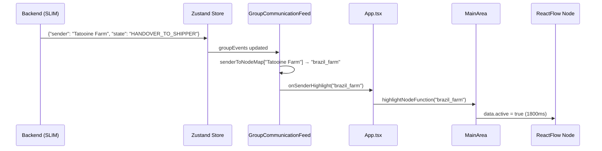

# Frontend Animation System: Real-Time Agent Flow Visualization

Technical documentation for how the Lungo frontend visualizes agent-to-agent communication in real-time, mapping backend streaming events to graph node highlights.

---

## Overview

The animation system has **two modes**:

| Pattern | Animation Source | Reflects Backend? |
|---------|-----------------|-------------------|
| **Publish/Subscribe** | Pre-defined sequence in config | ❌ No (simulated) |
| **Group Communication** | Real-time NDJSON stream | ✅ Yes (actual flow) |

---

## Architecture Flow

```
Backend SLIM Stream → Zustand Store → GroupCommunicationFeed → App → MainArea → ReactFlow Node
```



---

## Key Components

### 1. Sender-to-Node Mapping

**File**: `src/components/Chat/GroupCommunicationFeed.tsx`

Maps backend agent names to ReactFlow node IDs:

```typescript
const buildSenderToNodeMap = (graphConfig: any): Record<string, string> => {
  const map: Record<string, string> = {}

  graphConfig.nodes.forEach((node: any) => {
    if (node.data) {
      // Multiple mapping strategies
      if (node.data.label1) map[node.data.label1] = node.id
      if (node.data.farmName) map[node.data.farmName] = node.id
      if (node.data.agentName) map[node.data.agentName] = node.id

      // Alias: Backend sends "Supervisor", UI has "Buyer"
      if (node.data.label1 === "Buyer") {
        map["Supervisor"] = node.id
      }
    }
  })
  return map
}
```

**Resulting Map**:
```javascript
{
  "Supervisor": "auction_agent",
  "Buyer": "auction_agent",
  "Tatooine Farm": "brazil_farm",
  "Tatooine": "brazil_farm",
  "Shipper": "colombia_farm",
  "Accountant": "vietnam_farm"
}
```

---

### 2. Event Processing

**File**: `src/components/Chat/GroupCommunicationFeed.tsx`

```typescript
useEffect(() => {
  if (!groupEvents.length) return

  const lastEvent = groupEvents[groupEvents.length - 1]
  
  // Dedupe by event key
  const eventKey = `${lastEvent.order_id}-${lastEvent.timestamp}-${lastEvent.sender}`
  if (lastProcessedEventRef.current === eventKey) return
  lastProcessedEventRef.current = eventKey

  // Map sender → node ID
  const senderToNodeMap = buildSenderToNodeMap(graphConfig)
  const senderNodeId = senderToNodeMap[lastEvent.sender]

  if (senderNodeId) {
    onSenderHighlight(senderNodeId)  // Trigger highlight

    // Special: Supervisor broadcasts to ALL agents
    if (lastEvent.sender === "Supervisor") {
      const allAgentIds = getAllAgentNodeIds(graphConfig)
      allAgentIds.forEach((id, i) => {
        setTimeout(() => onSenderHighlight(id), i * 100)
      })
    }
  }
}, [groupEvents])
```

---

### 3. Highlight Function Chain

**App.tsx** - Wires the highlight callback:
```typescript
const handleNodeHighlightSetup = useCallback(
  (highlightFunction: (nodeId: string) => void) => {
    setHighlightNodeFunction(() => highlightFunction)
  }, []
)

const handleSenderHighlight = useCallback(
  (nodeId: string) => {
    if (highlightNodeFunction) {
      highlightNodeFunction(nodeId)
    }
  }, [highlightNodeFunction]
)
```

**MainArea.tsx** - Applies the visual highlight:
```typescript
const highlightNode = useCallback((nodeId: string) => {
  if (pattern === "group_communication") {
    updateStyle(nodeId, true)   // Highlight ON
    setTimeout(() => {
      updateStyle(nodeId, false) // Highlight OFF after 1800ms
    }, 1800)
  }
}, [updateStyle, pattern])

const updateStyle = useCallback((id: string, active: boolean) => {
  setNodes((nodes) =>
    nodes.map((node) =>
      node.id === id ? { ...node, data: { ...node.data, active } } : node
    )
  )
}, [setNodes])
```

---

### 4. Graph Configuration

**File**: `src/utils/graphConfigs.tsx`

Nodes with multiple name mappings:

```typescript
{
  id: NODE_IDS.BRAZIL_FARM,  // "brazil_farm"
  type: NODE_TYPES.CUSTOM,
  data: {
    label1: "Tatooine",           // Maps to node ID
    label2: "Coffee Farm Agent",   // Maps to node ID
    farmName: "Tatooine Farm",     // Maps to node ID (used by backend)
  },
}
```

---

## Streaming Event Format

Backend sends NDJSON with this structure:

```json
{
  "response": {
    "order_id": "abc123",
    "sender": "Tatooine Farm",
    "receiver": "Shipper",
    "message": "Order handed off for transit.",
    "state": "HANDOVER_TO_SHIPPER",
    "timestamp": "2025-12-17T02:30:00Z"
  }
}
```

| Field | Used For |
|-------|----------|
| `sender` | Node ID lookup for highlight |
| `state` | Detect completion (`DELIVERED`) |
| `order_id` | Event deduplication |

---

## State Flow Visualization

| Backend State | Sender | Highlighted Node |
|---------------|--------|------------------|
| `RECEIVED_ORDER` | Supervisor | `auction_agent` → all agents |
| `HANDOVER_TO_SHIPPER` | Tatooine Farm | `brazil_farm` |
| `CUSTOMS_CLEARANCE` | Shipper | `colombia_farm` |
| `PAYMENT_COMPLETE` | Accountant | `vietnam_farm` |
| `DELIVERED` | Shipper | `colombia_farm` |

---

## Summary

| Question | Answer |
|----------|--------|
| Where does sender info come from? | Backend NDJSON `event.sender` |
| How does UI map sender → node? | `buildSenderToNodeMap()` from graph config |
| How does highlight propagate? | Feed → App → MainArea → ReactFlow |
| How long does highlight last? | 1800ms via `setTimeout` |
| Does it show real backend flow? | ✅ Yes for Group Communication |
