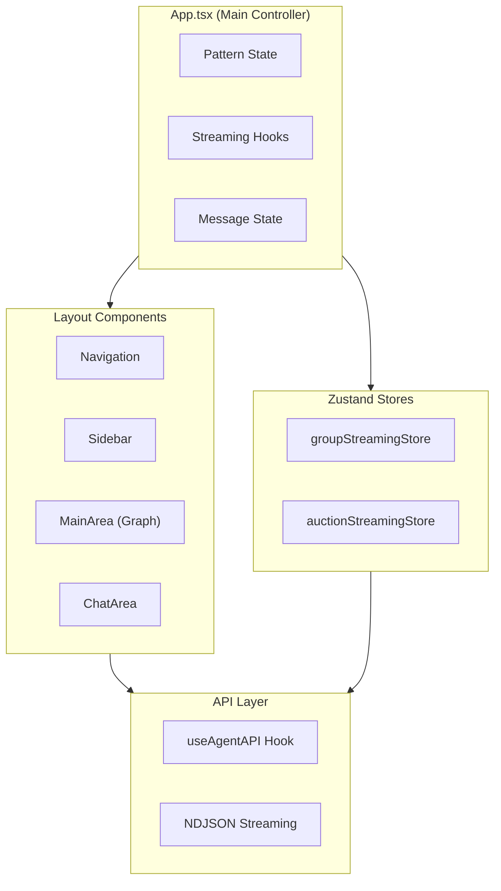

# Frontend Architecture Guide: Lungo Multi-Agent Dashboard

A comprehensive technical reference for the Lungo frontend application, covering the React architecture, state management, graph visualization, streaming patterns, and theming system.

---

## Table of Contents

1. [Technology Stack](#technology-stack)
2. [Project Structure](#project-structure)
3. [Application Architecture](#application-architecture)
4. [State Management with Zustand](#state-management-with-zustand)
5. [Graph Visualization with ReactFlow](#graph-visualization-with-reactflow)
6. [API Integration & Streaming](#api-integration--streaming)
7. [Pattern System](#pattern-system)
8. [Theming System](#theming-system)
9. [Component Reference](#component-reference)
10. [Code Examples](#code-examples)

---

## Technology Stack

### Core Dependencies

| Library | Version | Purpose |
|---------|---------|---------|
| `react` | `^19.1.0` | UI framework |
| `react-dom` | `^19.1.0` | DOM rendering |
| `typescript` | `^5.9.2` | Type safety |
| `vite` | `^6.4.1` | Build tool & dev server |
| `tailwindcss` | `^3.4.17` | Utility-first CSS |
| `@xyflow/react` | `^12.6.4` | Graph/flow visualization |
| `axios` | `^1.13.0` | HTTP client |
| `zustand` | (via stores) | State management |

### UI Libraries

| Library | Version | Purpose |
|---------|---------|---------|
| `lucide-react` | `^0.536.0` | Icons |
| `react-icons` | `^5.5.0` | Additional icons |
| `@radix-ui/react-select` | `^2.2.5` | Accessible select components |
| `class-variance-authority` | `^0.7.1` | Component variants |
| `clsx` | `^2.1.1` | Class name utilities |
| `tailwind-merge` | `^3.3.1` | Tailwind class merging |
| `tailwindcss-animate` | `^1.0.7` | Animation utilities |

### Development Tools

| Tool | Version | Purpose |
|------|---------|---------|
| `eslint` | `^9.25.0` | Linting |
| `prettier` | `^3.6.2` | Code formatting |
| `@vitejs/plugin-react` | `^4.4.1` | React plugin for Vite |
| `postcss` | `^8.5.6` | CSS processing |
| `autoprefixer` | `^10.4.21` | CSS vendor prefixes |

---

## Project Structure

```
frontend/
├── public/                     # Static assets
├── src/
│   ├── assets/                 # Images, icons, SVGs
│   ├── components/
│   │   ├── Chat/               # Chat interface components
│   │   │   ├── AuctionStreamingFeed.tsx
│   │   │   ├── ChatArea.tsx
│   │   │   ├── ChatHeader.tsx
│   │   │   ├── GroupCommunicationFeed.tsx
│   │   │   ├── Message.tsx
│   │   │   ├── Messages.tsx
│   │   │   ├── Prompts/
│   │   │   └── UserMessage.tsx
│   │   ├── MainArea/           # Graph visualization area
│   │   │   ├── Graph/          # ReactFlow node/edge components
│   │   │   ├── MainArea.tsx
│   │   │   ├── ModalContainer.tsx
│   │   │   └── ReactFlow.css
│   │   ├── Navigation/         # Top navigation bar
│   │   ├── Sidebar/            # Pattern selection sidebar
│   │   └── icons/              # Custom icon components
│   ├── contexts/               # React contexts
│   │   ├── ThemeContext.tsx
│   │   └── theme.ts
│   ├── hooks/                  # Custom React hooks
│   │   ├── useAgentAPI.ts
│   │   ├── useChatAreaMeasurement.ts
│   │   ├── useEscapeKey.ts
│   │   ├── useModalManager.ts
│   │   ├── useTheme.ts
│   │   ├── useThemeIcon.ts
│   │   ├── useThemeImage.ts
│   │   └── useViewportAwareFitView.ts
│   ├── stores/                 # Zustand state stores
│   │   ├── auctionStreamingStore.ts
│   │   └── groupStreamingStore.ts
│   ├── types/                  # TypeScript type definitions
│   │   ├── assets.d.ts
│   │   ├── message.ts
│   │   └── streaming.ts
│   ├── utils/                  # Utility functions
│   │   ├── cn.ts
│   │   ├── const.ts
│   │   ├── graphConfigs.tsx
│   │   ├── logger.ts
│   │   ├── patternUtils.ts
│   │   ├── retryUtils.ts
│   │   └── urls.json
│   ├── App.tsx                 # Main application component
│   ├── main.tsx                # Application entry point
│   └── index.css               # Global styles & CSS variables
├── components.json             # Shadcn/ui configuration
├── tailwind.config.js          # Tailwind configuration
├── vite.config.ts              # Vite configuration
├── tsconfig.json               # TypeScript configuration
└── package.json                # Dependencies & scripts
```

---

## Application Architecture

### High-Level Architecture



### Component Hierarchy

```
ThemeProvider
└── App
    ├── Navigation
    ├── Sidebar (pattern selection)
    ├── MainArea (ReactFlow graph)
    │   ├── ReactFlow
    │   │   ├── CustomNode
    │   │   ├── TransportNode
    │   │   ├── CustomEdge
    │   │   └── BranchingEdge
    │   └── ModalContainer
    └── ChatArea
        ├── ChatHeader
        ├── Messages
        │   ├── UserMessage
        │   └── Message
        ├── GroupCommunicationFeed
        ├── AuctionStreamingFeed
        └── Prompts
```

---

## State Management with Zustand

### Group Streaming Store

The `groupStreamingStore` manages logistics workflow state for group communication pattern.

```typescript
// src/stores/groupStreamingStore.ts

interface LogisticsStreamingState {
  events: LogisticsStreamStep[]      // Streaming events
  finalResponse: string | null       // Final delivery message
  isStreaming: boolean               // Connection status
  isComplete: boolean                // Workflow complete flag
  error: string | null               // Error message
  currentOrderId: string | null      // Active order ID
  executionKey: string | null        // Unique execution identifier
}

interface LogisticsStreamingActions {
  addEvent: (event: LogisticsStreamStep) => void
  setFinalResponse: (response: string) => void
  setError: (error: string) => void
  setStreaming: (streaming: boolean) => void
  setComplete: (complete: boolean) => void
  startStreaming: (prompt: string) => Promise<void>
  reset: () => void
}
```

### Usage Pattern

```typescript
// Consuming state with selector hooks
import {
  useGroupEvents,
  useGroupIsStreaming,
  useGroupIsComplete,
  useGroupFinalResponse,
  useGroupError,
  useStartGroupStreaming,
  useGroupStreamingActions,
} from "@/stores/groupStreamingStore"

// In component
const events = useGroupEvents()
const isStreaming = useGroupIsStreaming()
const startStreaming = useStartGroupStreaming()
const { reset } = useGroupStreamingActions()

// Start streaming
await startStreaming(userPrompt)
```

### NDJSON Streaming Implementation

```typescript
// Inside groupStreamingStore.startStreaming()
const response = await fetch(
  `${LOGISTICS_APP_API_URL}/agent/prompt/stream`,
  {
    method: "POST",
    headers: { "Content-Type": "application/json" },
    body: JSON.stringify({ prompt }),
  }
)

const reader = response.body?.getReader()
const decoder = new TextDecoder()
let buffer = ""

while (true) {
  const { done, value } = await reader.read()
  if (done) break

  buffer += decoder.decode(value, { stream: true })

  // Parse NDJSON manually (brace-balanced JSON objects)
  while (remaining.length > 0) {
    // Find complete JSON object by counting braces
    let braceCount = 0
    let jsonEnd = -1

    for (let i = 0; i < remaining.length; i++) {
      if (remaining[i] === "{") braceCount++
      else if (remaining[i] === "}") {
        braceCount--
        if (braceCount === 0) {
          jsonEnd = i
          break
        }
      }
    }

    if (jsonEnd === -1) break

    const jsonStr = remaining.substring(0, jsonEnd + 1)
    const parsed = JSON.parse(jsonStr)

    // Handle streaming event vs final response
    if (isValidLogisticsStreamStep(parsed.response)) {
      addEvent(parsed.response)
    } else {
      setFinalResponse(parsed.response)
    }
  }
}
```

---

## Graph Visualization with ReactFlow

### Graph Configuration Structure

```typescript
// src/utils/graphConfigs.tsx

export interface GraphConfig {
  title: string
  nodes: Node[]
  edges: Edge[]
  animationSequence: { ids: string[] }[]
}
```

### Node Types

| Type | Component | Purpose |
|------|-----------|---------|
| `customNode` | `CustomNode` | Agent nodes (Farm, Shipper, Accountant) |
| `transportNode` | `TransportNode` | Transport layer (SLIM/NATS) |

### Edge Types

| Type | Component | Purpose |
|------|-----------|---------|
| `custom` | `CustomEdge` | Standard A2A connections |
| `branching` | `BranchingEdge` | MCP connections with branches |

### Node Data Structure

```typescript
{
  id: "brazil_farm",
  type: "customNode",
  data: {
    icon: ,
    label1: "Tatooine",
    label2: "Coffee Farm Agent",
    handles: "all",              // "source" | "target" | "all"
    farmName: "Tatooine Farm",
    verificationStatus: "verified",
    hasBadgeDetails: true,
    hasPolicyDetails: true,
    githubLink: "https://github.com/...",
    agentDirectoryLink: "https://...",
  },
  position: { x: 550, y: 100 },
  parentId: "logistics_group",   // For grouped nodes
  extent: "parent",
}
```

### Animation System

```typescript
// MainArea.tsx - Animation implementation
const animate = async (ids: string[], active: boolean): Promise<void> => {
  ids.forEach((id) => updateStyle(id, active))
  await delay(DELAY_DURATION)
}

const animateGraph = async (): Promise<void> => {
  const animationSequence = config.animationSequence
  for (const step of animationSequence) {
    await animate(step.ids, true)   // Highlight ON
    await animate(step.ids, false)  // Highlight OFF
  }
}

// For Group Communication - highlight specific sender
const highlightNode = useCallback((nodeId: string) => {
  if (pattern === "group_communication") {
    updateStyle(nodeId, true)
    setTimeout(() => updateStyle(nodeId, false), 1800)
  }
}, [updateStyle, pattern])
```

### Group Communication Graph Config

```typescript
const GROUP_COMMUNICATION_CONFIG: GraphConfig = {
  title: "Secure Group Communication Logistics Network",
  nodes: [
    {
      id: "logistics_group",
      type: "group",
      data: { label: "Logistics Group" },
      position: { x: 50, y: 50 },
      style: {
        width: 900,
        height: 650,
        backgroundColor: "var(--group-background)",
        border: "none",
        borderRadius: "8px",
      },
    },
    {
      id: "auction_agent",
      type: "customNode",
      data: {
        icon: ,
        label1: "Buyer",
        label2: "Logistics Agent",
        handles: "source",
      },
      position: { x: 150, y: 100 },
      parentId: "logistics_group",
      extent: "parent",
    },
    // ... more nodes
  ],
  edges: [
    {
      id: "supervisor_to_transport",
      source: "auction_agent",
      target: "transport",
      targetHandle: "top_left",
      data: { label: "A2A" },
      type: "custom",
    },
    // ... more edges
  ],
  animationSequence: [
    { ids: ["auction_agent"] },
    { ids: ["supervisor_to_transport"] },
    { ids: ["transport"] },
    { ids: ["farm_to_transport", "transport_to_shipper", ...] },
    { ids: ["brazil_farm"] },
    { ids: ["colombia_farm"] },
    { ids: ["vietnam_farm"] },
  ],
}
```

---

## API Integration & Streaming

### useAgentAPI Hook

```typescript
// src/hooks/useAgentAPI.ts

interface UseAgentAPIReturn {
  loading: boolean
  sendMessage: (prompt: string, pattern?: string) => Promise<string>
  sendMessageWithCallback: (
    prompt: string,
    setMessages: React.Dispatch<React.SetStateAction<Message[]>>,
    callbacks?: {
      onStart?: () => void
      onSuccess?: (response: string) => void
      onError?: (error: any) => void
      onRetryAttempt?: (attempt: number, error: Error, nextRetryAt: number) => void
    },
    pattern?: string,
  ) => Promise<void>
  cancel: () => void
}
```

### API URL Configuration

```typescript
// src/utils/patternUtils.ts

export const getApiUrlForPattern = (pattern?: string): string => {
  const DEFAULT_PUB_SUB_API_URL = "http://127.0.0.1:8000"
  const DEFAULT_GROUP_COMM_APP_API_URL = "http://127.0.0.1:9090"

  const PUB_SUB_APP_API_URL =
    import.meta.env.VITE_EXCHANGE_APP_API_URL || DEFAULT_PUB_SUB_API_URL
  const GROUP_COMM_APP_API_URL =
    import.meta.env.VITE_LOGISTICS_APP_API_URL || DEFAULT_GROUP_COMM_APP_API_URL

  if (isGroupCommunication(pattern)) {
    return GROUP_COMM_APP_API_URL
  }
  return PUB_SUB_APP_API_URL
}
```

### Retry Configuration

```typescript
// src/utils/retryUtils.ts

export const RETRY_CONFIG = {
  maxRetries: 3,
  baseDelay: 2000,        // 2 seconds
  backoffMultiplier: 2,   // Exponential backoff
}

export const withRetry = async <T>(
  fn: () => Promise<T>,
  onRetryAttempt?: (attempt: number) => void,
): Promise<T> => {
  let attempt = 0
  while (attempt < RETRY_CONFIG.maxRetries) {
    try {
      return await fn()
    } catch (error) {
      attempt++
      if (attempt >= RETRY_CONFIG.maxRetries) throw error
      
      const delay = RETRY_CONFIG.baseDelay * 
        Math.pow(RETRY_CONFIG.backoffMultiplier, attempt - 1)
      
      onRetryAttempt?.(attempt)
      await new Promise(resolve => setTimeout(resolve, delay))
    }
  }
  throw new Error("Max retries exceeded")
}
```

---

## Pattern System

### Available Patterns

```typescript
// src/utils/patternUtils.ts

export const PATTERNS = {
  SLIM_A2A: "slim_a2a",
  PUBLISH_SUBSCRIBE: "publish_subscribe",
  PUBLISH_SUBSCRIBE_STREAMING: "publish_subscribe_streaming",
  GROUP_COMMUNICATION: "group_communication",
} as const

export type PatternType = (typeof PATTERNS)[keyof typeof PATTERNS]
```

### Pattern Utilities

```typescript
// Check pattern type
export const isGroupCommunication = (pattern?: string): boolean =>
  pattern === PATTERNS.GROUP_COMMUNICATION

export const isStreamingPattern = (pattern?: string): boolean =>
  pattern === PATTERNS.PUBLISH_SUBSCRIBE_STREAMING

// Feature flags by pattern
export const shouldEnableRetries = (pattern?: string): boolean =>
  isGroupCommunication(pattern)

export const supportsSSE = (pattern?: string): boolean =>
  isGroupCommunication(pattern)

export const supportsTransportUpdates = (pattern?: string): boolean =>
  pattern === PATTERNS.PUBLISH_SUBSCRIBE ||
  pattern === PATTERNS.PUBLISH_SUBSCRIBE_STREAMING

// Display names
export const getPatternDisplayName = (pattern?: string): string => {
  switch (pattern) {
    case PATTERNS.SLIM_A2A: return "Slim A2A"
    case PATTERNS.PUBLISH_SUBSCRIBE: return "Publish/Subscribe"
    case PATTERNS.PUBLISH_SUBSCRIBE_STREAMING: return "Publish/Subscribe: Streaming"
    case PATTERNS.GROUP_COMMUNICATION: return "Group Communication"
    default: return "Unknown Pattern"
  }
}
```

### Pattern-Based Routing in App.tsx

```typescript
const handleDropdownSelect = async (query: string) => {
  if (selectedPattern === PATTERNS.GROUP_COMMUNICATION) {
    // Use streaming store for group communication
    resetGroup()
    await startStreaming(query)
    
  } else if (selectedPattern === PATTERNS.PUBLISH_SUBSCRIBE_STREAMING) {
    // Use auction streaming store
    reset()
    await connect(query)
    
  } else {
    // Standard sync API call
    const response = await sendMessage(query, selectedPattern)
    handleApiResponse(response)
  }
}
```

---

## Theming System

### CSS Variables Architecture

The application uses CSS variables with a `data-theme` attribute on the body for light/dark mode switching.

```css
/* src/index.css */

:root {
  /* Dark mode (default) */
  --app-background: #23282e;
  --node-background: #373c42;
  --node-background-active: #00142b;
  --node-text-primary: #e8e9ea;
  --accent-primary: #187adc;
  --chat-background: #1a2432;
  --chat-text: #fbfcfe;
  --sidebar-background: #23282e;
  /* ... more variables */
}

body[data-theme="light"] {
  /* Light mode overrides */
  --app-background: #f5f8fd;
  --node-background: #dee6f9;
  --node-background-active: #187adc;
  --node-text-primary: #3c4551;
  --chat-background: #dee6f9;
  --chat-text: #00142b;
  --sidebar-background: #fbfcfe;
  /* ... more variables */
}
```

### Tailwind Integration

```javascript
// tailwind.config.js

export default {
  darkMode: ["class"],
  content: ["./index.html", "./src/**/*.{js,ts,jsx,tsx}"],
  theme: {
    extend: {
      colors: {
        "app-background": "var(--app-background)",
        "node-background": "var(--node-background)",
        "node-background-active": "var(--node-background-active)",
        "node-text-primary": "var(--node-text-primary)",
        "chat-background": "var(--chat-background)",
        "chat-text": "var(--chat-text)",
        "accent-primary": "var(--accent-primary)",
        // ... mapped to CSS variables
      },
    },
  },
}
```

### Theme Context

```typescript
// src/contexts/ThemeContext.tsx

interface ThemeContextType {
  theme: Theme                    // "light" | "dark" | "system"
  setTheme: (theme: Theme) => void
  toggleTheme: () => void
  isLightMode: boolean
  resolvedTheme: "light" | "dark"
}

export const ThemeProvider: React.FC<ThemeProviderProps> = ({ children }) => {
  const [theme, setThemeState] = useState<Theme>(() => {
    const saved = localStorage.getItem("theme")
    return (saved as Theme) || "dark"
  })

  const [systemTheme, setSystemTheme] = useState<"light" | "dark">(() => {
    return window.matchMedia("(prefers-color-scheme: light)").matches
      ? "light"
      : "dark"
  })

  const resolvedTheme = theme === "system" ? systemTheme : theme

  useEffect(() => {
    // Apply theme to body
    if (resolvedTheme === "light") {
      document.body.setAttribute("data-theme", "light")
    } else {
      document.body.removeAttribute("data-theme")
    }
    localStorage.setItem("theme", theme)
  }, [theme, resolvedTheme])

  // Listen for system preference changes
  useEffect(() => {
    const mediaQuery = window.matchMedia("(prefers-color-scheme: light)")
    const handleChange = (e: MediaQueryListEvent) => {
      setSystemTheme(e.matches ? "light" : "dark")
    }
    mediaQuery.addEventListener("change", handleChange)
    return () => mediaQuery.removeEventListener("change", handleChange)
  }, [])

  return (
    <ThemeContext.Provider value={{ theme, setTheme, toggleTheme, isLightMode, resolvedTheme }}>
      {children}
    </ThemeContext.Provider>
  )
}
```

### Theme-Aware Icons

```css
/* Dark mode icon filter */
.dark-icon {
  filter: brightness(0) invert(1);
}

/* Light mode icon filter */
body[data-theme="light"] .dark-icon {
  filter: brightness(0) saturate(0) opacity(0.6);
}
```

---

## Streaming Types

### LogisticsStreamStep Interface

```typescript
// src/types/streaming.ts

interface LogisticsStreamStep {
  order_id: string      // UUID of the order
  sender: string        // Agent name (Supervisor, Tatooine Farm, Shipper, Accountant)
  receiver: string      // Target agent name
  message: string       // Status message
  timestamp: string     // ISO timestamp
  state: string         // RECEIVED_ORDER | HANDOVER_TO_SHIPPER | CUSTOMS_CLEARANCE | PAYMENT_COMPLETE | DELIVERED
}
```

### Validation Function

```typescript
const isValidLogisticsStreamStep = (data: any): data is LogisticsStreamStep => {
  if (!data || typeof data !== "object") return false

  const requiredFields = [
    "order_id", "sender", "receiver", "message", "timestamp", "state"
  ]

  for (const field of requiredFields) {
    if (typeof data[field] !== "string" || data[field].trim() === "") {
      return false
    }
  }

  return true
}
```

---

## Component Reference

### Key Components

| Component | Path | Purpose |
|-----------|------|---------|
| `App` | `src/App.tsx` | Main controller, pattern routing, state coordination |
| `MainArea` | `src/components/MainArea/MainArea.tsx` | ReactFlow wrapper with animation |
| `ChatArea` | `src/components/Chat/ChatArea.tsx` | Chat interface container |
| `GroupCommunicationFeed` | `src/components/Chat/GroupCommunicationFeed.tsx` | Streaming event display |
| `CustomNode` | `src/components/MainArea/Graph/Elements/CustomNode.tsx` | Agent node rendering |
| `TransportNode` | `src/components/MainArea/Graph/Elements/transportNode.tsx` | Transport layer node |
| `Sidebar` | `src/components/Sidebar/Sidebar.tsx` | Pattern selection |
| `Navigation` | `src/components/Navigation/Navigation.tsx` | Top navbar with theme toggle |

### Custom Hooks

| Hook | Path | Purpose |
|------|------|---------|
| `useAgentAPI` | `src/hooks/useAgentAPI.ts` | API calls with retry logic |
| `useTheme` | `src/hooks/useTheme.ts` | Theme context consumer |
| `useModalManager` | `src/hooks/useModalManager.ts` | Modal state management |
| `useViewportAwareFitView` | `src/hooks/useViewportAwareFitView.ts` | ReactFlow viewport adjustment |
| `useChatAreaMeasurement` | `src/hooks/useChatAreaMeasurement.ts` | Dynamic chat height |

---

## Environment Variables

```bash
# API Endpoints
VITE_EXCHANGE_APP_API_URL=http://127.0.0.1:8000
VITE_LOGISTICS_APP_API_URL=http://127.0.0.1:9090
```

---

## Build & Development

### Available Scripts

```bash
# Development server
npm run dev

# Production build
npm run build

# Preview production build
npm run preview

# Linting
npm run lint
npm run lint:check

# Formatting
npm run format
npm run format:check
```

### Vite Configuration

```typescript
// vite.config.ts

import { defineConfig } from "vite"
import react from "@vitejs/plugin-react"
import path from "path"

export default defineConfig({
  plugins: [react()],
  server: {
    fs: {
      strict: true,
      allow: [path.resolve(__dirname)],
    },
  },
  resolve: {
    alias: {
      "@": path.resolve(__dirname, "src"),
    },
    extensions: [".tsx", ".ts", ".jsx", ".js", ".json"],
  },
})
```

---

## Key Patterns & Best Practices

### 1. Selector Hooks for Zustand
```typescript
// Export individual selectors for optimal re-renders
export const useGroupEvents = () =>
  useGroupStreamingStore((state) => state.events)

export const useGroupIsStreaming = () =>
  useGroupStreamingStore((state) => state.isStreaming)
```

### 2. Callback Memoization
```typescript
const highlightNode = useCallback((nodeId: string) => {
  if (pattern === "group_communication") {
    updateStyle(nodeId, true)
    setTimeout(() => updateStyle(nodeId, false), 1800)
  }
}, [updateStyle, pattern])
```

### 3. Pattern-Based Conditional Rendering
```typescript
<ChatArea
  showCoffeePrompts={
    selectedPattern === PATTERNS.PUBLISH_SUBSCRIBE ||
    selectedPattern === PATTERNS.PUBLISH_SUBSCRIBE_STREAMING
  }
  showLogisticsPrompts={
    selectedPattern === PATTERNS.GROUP_COMMUNICATION
  }
/>
```

### 4. CSS Variable-Based Theming
```tsx
// Use Tailwind classes that reference CSS variables
<div className="bg-app-background text-chat-text">
  <span className="text-node-text-primary">Agent</span>
</div>
```

---

*This documentation provides a comprehensive reference for understanding, maintaining, and extending the Lungo frontend application.*
