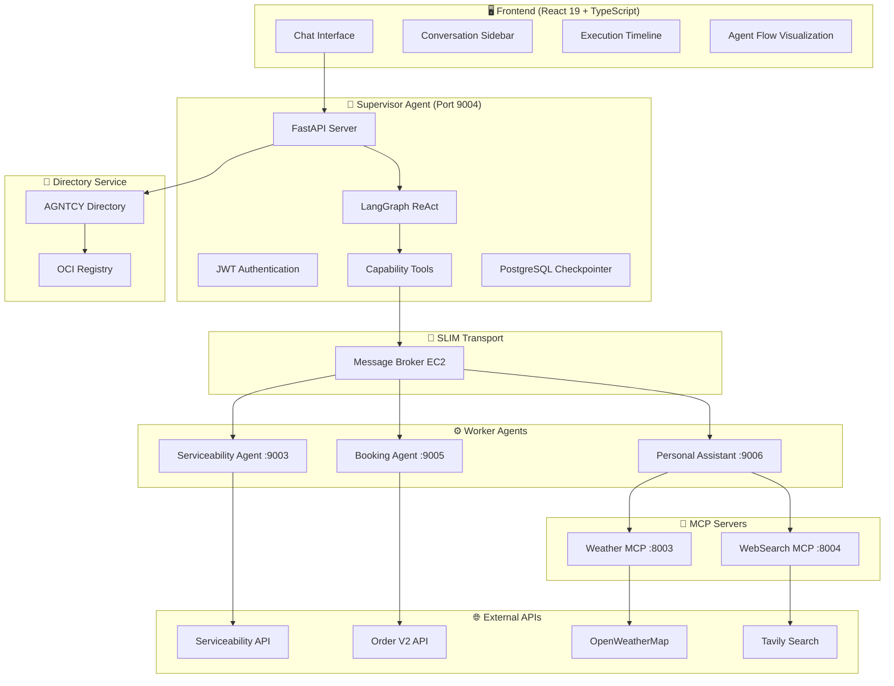
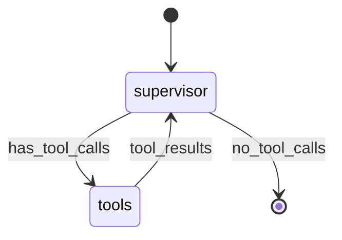
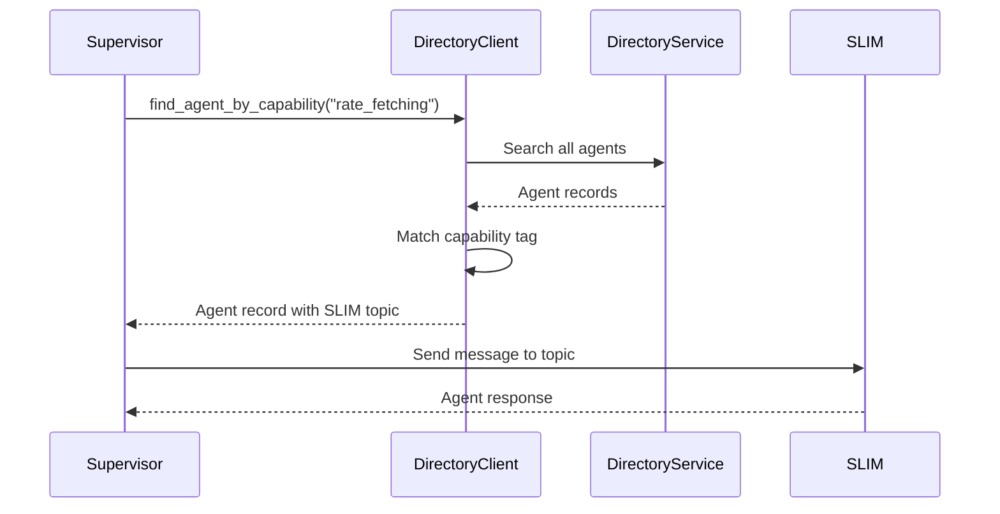
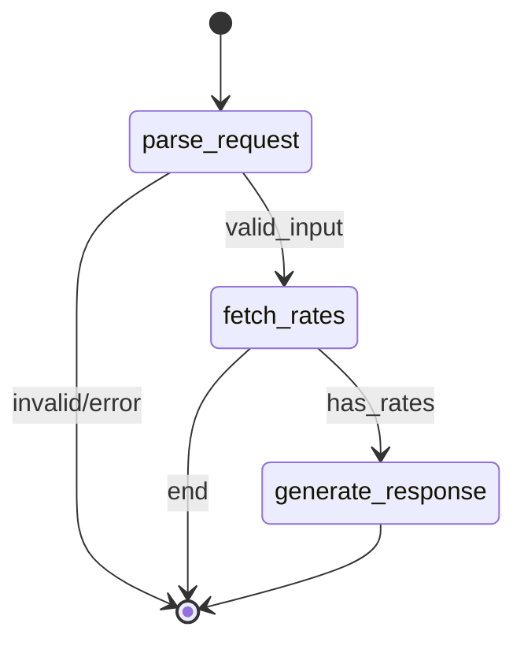
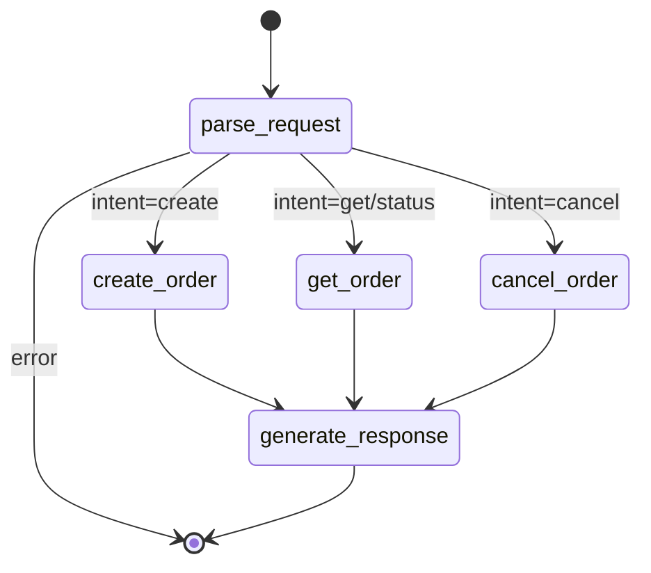
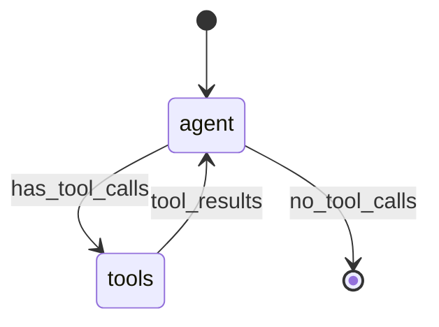
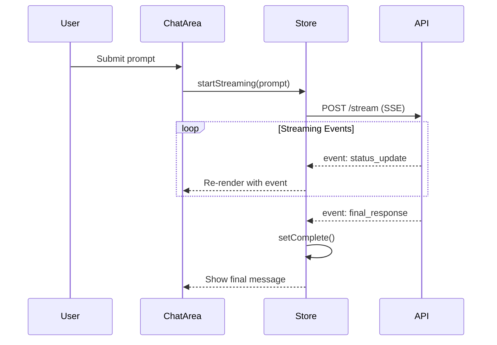

# Agentic Orchestrator - Implementation Details

> Comprehensive technical documentation of the multi-agent logistics orchestration system.

*Last updated: December 31, 2024*

---

## 📋 Table of Contents

1. [System Overview](#system-overview)
2. [Architecture](#architecture)
3. [Supervisor Agent](#supervisor-agent)
4. [Worker Agents](#worker-agents)
   - [Serviceability Agent](#serviceability-agent)
   - [Booking Agent](#booking-agent)
   - [Personal Assistant Agent](#personal-assistant-agent)
5. [MCP Servers](#mcp-servers)
6. [Frontend Application](#frontend-application)
7. [Authentication System](#authentication-system)
8. [Data Persistence](#data-persistence)
9. [Communication Layer](#communication-layer)
10. [Configuration & Environment](#configuration--environment)
11. [Deployment](#deployment)

---

## System Overview

The **Agentic Orchestrator** is a production-grade multi-agent AI system implementing the **AGNTCY Internet of Agents (IoA)** architecture. It enables natural language interactions for logistics operations through a supervisor-worker agent topology.

### Key Capabilities

| Capability | Description | Agent |
|------------|-------------|-------|
| **Rate Fetching** | Check carrier rates and serviceability | Serviceability Agent |
| **Route Validation** | Validate shipping routes | Serviceability Agent |
| **Order Creation** | Create shipping orders | Booking Agent |
| **Order Tracking** | Track order status | Booking Agent |
| **Order Cancellation** | Cancel existing orders | Booking Agent |
| **Weather Info** | Get current weather conditions | Personal Assistant |
| **Web Search** | Search the web for information | Personal Assistant |

---

## Architecture



### Design Patterns

1. **Supervisor-Worker Topology** - Central supervisor orchestrates specialized worker agents
2. **Capability-Based Discovery** - Agents are discovered by capabilities, not hardcoded names
3. **ReAct Pattern** - Reasoning + Acting loop for decision making
4. **State Machine Workflows** - LangGraph for deterministic agent flows
5. **Factory Pattern** - LLM and transport factory for vendor abstraction
6. **Dependency Inversion** - Abstract interfaces for LLM providers

---

## Supervisor Agent

The Supervisor Agent is the orchestration hub that routes user requests to appropriate worker agents based on their registered capabilities.

### Location
```
src/orchestrator/supervisor_agent/
├── agent/
│   ├── graph.py         # LangGraph workflow definition
│   ├── nodes.py         # Supervisor and Tool nodes
│   ├── tools.py         # delegate_to_capability tool
│   ├── router.py        # Discovery router implementation
│   ├── directory.py     # Directory service client
│   ├── memory.py        # PostgreSQL checkpointer
│   ├── llm_factory.py   # LLM provider factory
│   └── state.py         # Agent state definition
├── app/
│   ├── main.py          # FastAPI application (954 lines)
│   ├── auth.py          # JWT authentication
│   ├── oauth.py         # OAuth 2.0 providers
│   └── services/
│       ├── llm_config_service.py  # Per-user LLM configuration
│       └── encryption.py          # API key encryption
└── agent_record.json    # OASF agent record
```

### LangGraph Workflow



**Implementation** ([graph.py](file:///Users/avinash/Developer/Projects/prayog/agentic-orchestrator/src/orchestrator/supervisor_agent/agent/graph.py)):

```python
def build_graph(checkpointer: Optional[BaseCheckpointSaver] = None):
    nodes = SupervisorNodes()
    workflow = StateGraph(SupervisorAgentState)

    workflow.add_node("supervisor", nodes.supervisor_node)
    workflow.add_node("tools", nodes.tool_node)

    workflow.set_entry_point("supervisor")
    workflow.add_conditional_edges(
        "supervisor",
        should_continue,
        {"tools": "tools", END: END}
    )
    workflow.add_edge("tools", "supervisor")

    return workflow.compile(checkpointer=checkpointer)
```

### Capability-Based Discovery

The supervisor uses a **single tool** for all agent delegation:

```python
@tool
async def delegate_to_capability(capability: str, message: str) -> str:
    """
    Delegate a task to an agent with the specified capability.
    
    Available capabilities:
    - "rate_fetching": Check shipping rates, serviceability
    - "route_validation": Validate shipping routes
    - "order_creation": Create new shipping orders
    - "order_tracking": Track existing orders
    - "personal_assistant": Weather, web search
    """
```

### Discovery Router Flow



### System Prompt

The supervisor LLM uses a comprehensive system prompt:

```
You are a Logistics Supervisor.
Use the `delegate_to_capability` tool to route tasks to the right agent.

Available Capabilities:
- "rate_fetching": Check rates. REQUIRED: Origin pincode, Destination pincode, Weight.
- "order_creation": Create orders. REQUIRED: partner_code, origin, destination, weight.

CRITICAL RULES:
1. Agents are STATELESS - include ALL context in every message.
2. NEVER guess rates - use "rate_fetching" capability.
3. NEVER claim an order is created without using "order_creation".
```

### API Endpoints

| Endpoint | Method | Description |
|----------|--------|-------------|
| `/supervisor-agent/run` | POST | Run agent (sync) |
| `/supervisor-agent/stream` | POST | Stream agent (SSE) |
| `/supervisor-agent/conversations` | GET | List conversations |
| `/supervisor-agent/conversations/{id}` | GET | Get conversation |
| `/supervisor-agent/auth/register` | POST | User registration |
| `/supervisor-agent/auth/login` | POST | User login |
| `/supervisor-agent/auth/{provider}/authorize` | GET | OAuth initiation |
| `/.well-known/agent.json` | GET | OASF discovery |

---

## Worker Agents

### Serviceability Agent

Handles rate fetching and route validation by calling an external serviceability API.

**Location**: `src/orchestrator/serviceability_agent/`

**Port**: 9003

**Capabilities**: `rate_fetching`, `route_validation`

#### LangGraph Workflow



**Node Implementation** ([nodes.py](file:///Users/avinash/Developer/Projects/prayog/agentic-orchestrator/src/orchestrator/serviceability_agent/agent/nodes.py)):

```python
class ServiceabilityNodes:
    async def parse_request(self, state):
        """Extract origin, destination, weight from natural language."""
        
    async def fetch_rates(self, state):
        """Call external serviceability API."""
        
    async def generate_response(self, state):
        """Format rates response using LLM."""
```

#### External API Client

```python
class ServiceabilityClient:
    async def check_serviceability(
        self,
        origin_pincode: str,
        dest_pincode: str,
        weight_kg: float = 1.0,
        ...
    ) -> ServiceabilityResponse:
        """Call /serviceability/v3/check endpoint."""
```

#### Domain Models

```python
@dataclass
class ServiceabilityRequest:
    source_location: Location
    destination_location: Location
    packages: list[Package]

@dataclass
class Partner:
    code: str
    name: str
    services: list[Service]
    rates: list[Rate]
```

---

### Booking Agent

Handles order creation, tracking, and cancellation via Order V2 API.

**Location**: `src/orchestrator/booking_agent/`

**Port**: 9005

**Capabilities**: `order_creation`, `order_tracking`

#### LangGraph Workflow



**Node Implementation** ([nodes.py](file:///Users/avinash/Developer/Projects/prayog/agentic-orchestrator/src/orchestrator/booking_agent/agent/nodes.py)):

```python
class BookingNodes:
    async def parse_request(self, state):
        """Extract order intent: create, get, cancel."""
        
    async def create_order(self, state):
        """Create order via Order V2 API."""
        
    async def get_order(self, state):
        """Get order details by order_id."""
        
    async def cancel_order(self, state):
        """Cancel order with reason."""
        
    async def generate_response(self, state):
        """Format response using LLM."""
```

#### LLM Extraction Prompt

```
You are an order assistant that extracts order intent from user messages.

ACTIONS:
- "create" - User wants to create a new order
- "get" - User wants order status/details
- "cancel" - User wants to cancel an order

Extract ALL available fields:
- partner_code, sender_name, sender_phone
- origin_street, origin_city, origin_pincode
- receiver_name, receiver_phone
- dest_street, dest_city, dest_pincode
- weight_kg, length_cm, width_cm, height_cm
- payment_type (PREPAID/COD/TOPAY)
```

---

### Personal Assistant Agent

A new agent with weather and web search capabilities via MCP (Model Context Protocol) servers.

**Location**: `src/orchestrator/personal_assistant_agent/`

**Port**: 9006

**Capabilities**: `personal_assistant`, `weather_info`, `web_search`

#### LangGraph Workflow



#### MCP Integration

The Personal Assistant connects to FastMCP servers via HTTP/JSON-RPC:

```python
class MCPClient:
    """Client for MCP servers via SSE transport."""
    
    async def call_tool(self, tool_name: str, arguments: dict) -> str:
        response = await client.post(
            f"{self.server_url}/",
            json={
                "jsonrpc": "2.0",
                "method": "tools/call",
                "params": {"name": tool_name, "arguments": arguments},
                "id": 1
            }
        )
```

#### Available Tools

| Tool | MCP Server | Description |
|------|------------|-------------|
| `get_current_weather` | Weather MCP | Current weather conditions |
| `get_weather_forecast` | Weather MCP | Multi-day forecast |
| `web_search` | WebSearch MCP | Web search with AI summary |
| `read_webpage` | WebSearch MCP | Extract page content |

---

## MCP Servers

Built with [FastMCP](https://gofastmcp.com/) for Model Context Protocol compliance.

### Weather MCP Server

**Location**: `src/orchestrator/mcp_servers/weather/`

**Port**: 8003

**Provider**: OpenWeatherMap API

```python
from fastmcp import FastMCP

mcp = FastMCP("Weather")

@mcp.tool
async def get_current_weather(location: str) -> str:
    """Get current weather for a location."""
    data = await fetch_weather_from_openweathermap(location)
    return format_weather_response(data)

@mcp.tool
async def get_weather_forecast(location: str, days: int = 5) -> str:
    """Get multi-day weather forecast."""
    data = await fetch_forecast_from_openweathermap(location, days)
    return format_forecast_response(data)
```

### WebSearch MCP Server

**Location**: `src/orchestrator/mcp_servers/websearch/`

**Port**: 8004

**Provider**: Tavily Search API

```python
mcp = FastMCP("WebSearch")

@mcp.tool
async def search_web(query: str, max_results: int = 5) -> str:
    """Search the web for information."""
    response = await search_with_tavily(query, max_results)
    return format_search_results(response)

@mcp.tool
async def extract_content(url: str) -> str:
    """Extract and summarize content from a URL."""
    result = await extract_url_content(url)
    return format_extracted_content(result)
```

---

## Frontend Application

Modern React 19 application with real-time streaming and agent visualization.

**Location**: `src/frontend/`

**Port**: 3000

### Technology Stack

| Technology | Version | Purpose |
|------------|---------|---------|
| React | 19.2.0 | UI Framework |
| TypeScript | 5.9.3 | Type Safety |
| Vite | 7.2.4 | Build Tool |
| TailwindCSS | 4.1.17 | Styling |
| Zustand | 5.0.9 | State Management |
| @xyflow/react | 12.10.0 | Flow Diagrams |
| Dexie | 4.0.10 | IndexedDB |

### Component Structure

```
src/
├── App.tsx                    # Root component with resizable panels
├── components/
│   ├── Auth/
│   │   └── AuthScreen.tsx     # Login/Register forms
│   ├── Chat/
│   │   ├── ChatArea.tsx       # Message display with streaming
│   │   ├── ChatSidebar.tsx    # Conversation history
│   │   ├── ExecutionTimeline.tsx  # Agent activity timeline
│   │   ├── ModelSelector.tsx  # LLM model configuration
│   │   └── StreamingFeed.tsx  # Real-time event feed
│   ├── MainArea/
│   │   └── AgentFlowDiagram.tsx  # XY Flow visualization
│   ├── Navigation/
│   │   └── TopNav.tsx         # Theme toggle, settings
│   └── Settings/
│       └── LLMSettings.tsx    # Per-user LLM configuration
├── stores/
│   ├── chatHistoryStore.ts    # Conversations & messages
│   └── orchestratorStreamingStore.ts  # SSE streaming state
└── types/
    └── streaming.ts           # Event type definitions
```

### State Management

#### Chat History Store

Hybrid approach using IndexedDB cache with backend API sync:

```typescript
interface ChatHistoryState {
  isAuthenticated: boolean
  token: string | null
  userId: string | null
  tenantId: string | null
  conversations: Conversation[]
  messages: Message[]
  llmConfig: LLMConfig | null
}

// Actions
- initSession()      // Load from IndexedDB
- syncWithBackend()  // Sync with PostgreSQL
- addUserMessage()   // Add user message
- addAssistantMessage()  // Add AI response with activity
```

#### Streaming Store

Manages SSE connection and real-time events:

```typescript
interface StreamingState {
  status: 'idle' | 'streaming' | 'complete' | 'error'
  events: OrchestratorStreamStep[]
  finalResponse: string | null
  error: string | null
}

// Actions
- startStreaming(prompt)  // Open SSE connection
- addEvent(event)         // Add streaming event
- stopStreaming()         // Abort connection
```

### Streaming Event Flow



---

## Authentication System

### JWT Authentication

**Implementation**: [auth.py](file:///Users/avinash/Developer/Projects/prayog/agentic-orchestrator/src/orchestrator/supervisor_agent/app/auth.py)

```python
# Password hashing
def verify_password(plain_password, hashed_password):
    return bcrypt.checkpw(plain_password.encode(), hashed_password.encode())

# JWT token creation
def create_access_token(data: dict, expires_delta: Optional[timedelta] = None):
    to_encode = data.copy()
    expire = datetime.utcnow() + (expires_delta or timedelta(days=7))
    to_encode.update({"exp": expire})
    return jwt.encode(to_encode, SECRET_KEY, algorithm=ALGORITHM)
```

### OAuth 2.0 Support

**Implementation**: [oauth.py](file:///Users/avinash/Developer/Projects/prayog/agentic-orchestrator/src/orchestrator/supervisor_agent/app/oauth.py)

Vendor-agnostic OAuth with abstract provider interface:

```python
class OAuthProvider(ABC):
    @property
    @abstractmethod
    def name(self) -> str: ...
    
    @abstractmethod
    async def get_authorization_url(self, state: str) -> str: ...
    
    @abstractmethod
    async def handle_callback(self, code: str) -> tuple[OAuthTokens, OAuthUserInfo]: ...

class GoogleOAuthProvider(OAuthProvider):
    """Google OAuth 2.0 with Calendar, Gmail, Tasks scopes."""
```

### Per-User LLM Configuration

Users can configure their own LLM providers and API keys:

```python
class LLMConfigService:
    """Manage per-user LLM configurations with encrypted API keys."""
    
    async def get_active_config(self, user_id: str) -> Optional[dict]:
        """Get active LLM config for user."""
        
    async def create_config(self, user_id, provider, model_name, api_key, config_name):
        """Create new config with encrypted API key."""
        
    async def activate_config(self, user_id: str, config_id: str):
        """Set config as active, deactivate others."""
```

---

## Data Persistence

### PostgreSQL (AWS RDS)

#### Tables

| Table | Purpose |
|-------|---------|
| `users` | User accounts |
| `oauth_tokens` | OAuth refresh tokens per provider |
| `llm_configs` | Per-user LLM configurations |
| `checkpoints` | LangGraph conversation state |
| `checkpoint_blobs` | Serialized checkpoint data |
| `checkpoint_writes` | Pending checkpoint writes |

### LangGraph Checkpointer

Production-grade PostgreSQL checkpointer with connection pooling:

```python
POOL_CONFIG = {
    "min_size": 2,
    "max_size": 10,
    "max_idle": 120,
    "max_lifetime": 1800,  # 30 minutes
    "check": AsyncConnectionPool.check_connection,
    "reconnect_failed": True,
}

@asynccontextmanager
async def checkpointer_lifespan():
    """Create connection pool with health checks."""
    _connection_pool = AsyncConnectionPool(
        DATABASE_URL,
        **POOL_CONFIG,
        kwargs={"autocommit": True, "prepare_threshold": 0, "row_factory": dict_row}
    )
    await _connection_pool.open()
    _checkpointer_instance = AsyncPostgresSaver(conn=_connection_pool)
    await _checkpointer_instance.setup()
    yield
```

### IndexedDB (Frontend)

Dexie.js wrapper for offline-first conversation cache:

```typescript
class ChatDatabase extends Dexie {
  conversations!: Table<DBConversation>
  messages!: Table<DBMessage>

  constructor() {
    super('ChatHistoryDB')
    this.version(2).stores({
      conversations: 'id, userId, updatedAt',
      messages: 'id, conversationId, timestamp'
    })
  }
}
```

---

## Communication Layer

### SLIM Transport

SLIM (Simplified Lightweight Inter-agent Messaging) is the AGNTCY transport layer for agent-to-agent communication.

**Endpoint**: `http://3.7.70.176:46357` (EC2 instance)

#### Message Flow

```python
class DiscoveryRouter:
    async def route_by_capability(self, capability: str, payload: str) -> str:
        # 1. Find agent with capability in Directory
        record = self.directory.find_agent_by_capability(capability)
        
        # 2. Extract SLIM topic from agent description
        topic = extract_topic_from_description(record["description"])
        
        # 3. Send via SLIM transport
        factory = get_factory()
        response = await factory.send(topic, payload)
        
        return response
```

### Agent Registration

Agents register with the Directory Service at startup:

```python
async def run_dual_mode():
    """Run HTTP + SLIM servers with Directory registration."""
    try:
        DirectoryClient().register_agent("agent_record.json")
    except Exception as e:
        logger.error(f"Failed to register with Directory: {e}")
```

### Agent Record Format (OASF)

```json
{
    "name": "Serviceability Agent",
    "description": "Validates shipping routes... [TOPIC:logistics.serviceability.v1] [CAPABILITY:rate_fetching] [CAPABILITY:route_validation]",
    "version": "1.0.0",
    "schema_version": "0.8.0",
    "skills": [
        {"name": "natural_language_processing/...", "id": 10103}
    ],
    "domains": [
        {"name": "transportation/logistics", "id": 801}
    ]
}
```

---

## Configuration & Environment

### Environment Variables

| Variable | Description | Default |
|----------|-------------|---------|
| `SUPERVISOR_LLM` | Supervisor LLM model | `openrouter/openai/gpt-4o-mini` |
| `SERVICEABILITY_AGENT_LLM` | Serviceability LLM | `openrouter/openai/gpt-4o-mini` |
| `BOOKING_AGENT_LLM` | Booking LLM | `openrouter/openai/gpt-4o-mini` |
| `OPENROUTER_API_KEY` | OpenRouter API key | - |
| `GROQ_API_KEY` | Groq API key | - |
| `DATABASE_URL` | PostgreSQL connection | Required |
| `SLIM_ENDPOINT` | SLIM transport URL | `http://3.7.70.176:46357` |
| `DIRECTORY_SERVICE_ADDR` | Directory service | `oci-registry:8888` |
| `SERVICEABILITY_API_URL` | External rates API | - |
| `ORDER_API_URL` | Order V2 API | - |
| `OPENWEATHERMAP_API_KEY` | Weather API key | - |
| `TAVILY_API_KEY` | Tavily search key | - |
| `JWT_SECRET_KEY` | JWT signing key | - |
| `GOOGLE_CLIENT_ID` | OAuth client ID | - |
| `GOOGLE_CLIENT_SECRET` | OAuth client secret | - |

### Docker Compose Services

```yaml
services:
  # Infrastructure
  directory-service:     # AGNTCY Directory (port 8888 via oci-registry)
  oci-registry:          # OCI Registry (ports 5000, 8090, 8091)
  
  # Agents
  supervisor-agent:      # Port 9004
  serviceability-agent:  # Port 9003
  booking-agent:         # Port 9005
  personal-assistant-agent:  # Port 9006
  
  # MCP Servers
  weather-mcp:           # Port 8003
  websearch-mcp:         # Port 8004
  
  # Frontend
  frontend:              # Port 3000
```

---

## Deployment

### Docker Build

Each agent has its own Dockerfile:

```dockerfile
# Example: supervisor-agent/Dockerfile
FROM python:3.12-slim
WORKDIR /app
COPY . .
RUN pip install uv && uv pip install -e .
CMD ["python", "-m", "app.main"]
```

### CI/CD Pipeline

Jenkins pipelines for each service:

```groovy
// Example: supervisor-agent/Jenkinsfile
pipeline {
    stages {
        stage('Build') {
            steps {
                sh 'docker build -t supervisor-agent .'
            }
        }
        stage('Push to ECR') {
            steps {
                sh 'docker push ${ECR_REGISTRY}/supervisor-agent:${BUILD_NUMBER}'
            }
        }
        stage('Deploy to ECS') {
            steps {
                sh 'aws ecs update-service --cluster prod --service supervisor-agent --force-new-deployment'
            }
        }
    }
}
```

### AWS Deployment

| Component | AWS Service |
|-----------|-------------|
| Container Registry | ECR |
| Container Orchestration | ECS (Fargate) |
| Database | RDS PostgreSQL |
| SLIM Transport | EC2 |
| Load Balancer | ALB |

---

## Summary

The Agentic Orchestrator implements a robust multi-agent system with:

- **5 Agents**: Supervisor + 4 specialized workers
- **2 MCP Servers**: Weather and WebSearch
- **Capability-Based Discovery**: Dynamic agent routing via Directory Service
- **SLIM Transport**: Inter-agent messaging
- **PostgreSQL Persistence**: Conversation checkpointing
- **JWT + OAuth**: Secure authentication
- **React 19 Frontend**: Real-time streaming UI
- **Production Deployment**: Docker + AWS ECS

The architecture follows AGNTCY IoA standards for agent interoperability and uses LangGraph for state machine workflows, enabling reliable and maintainable agent orchestration.
