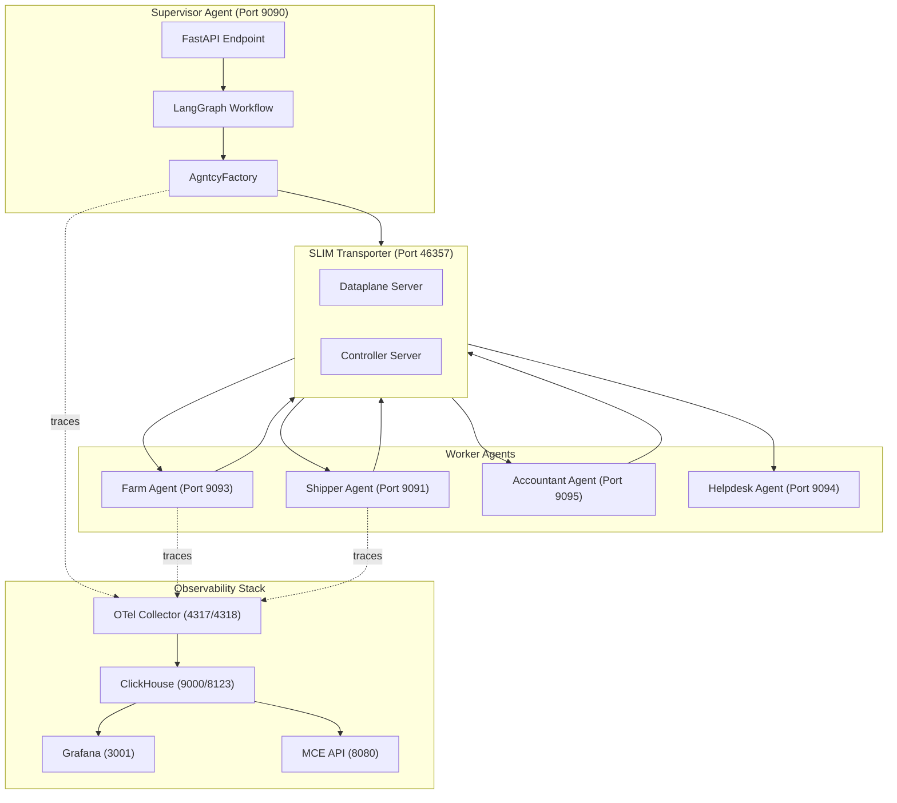
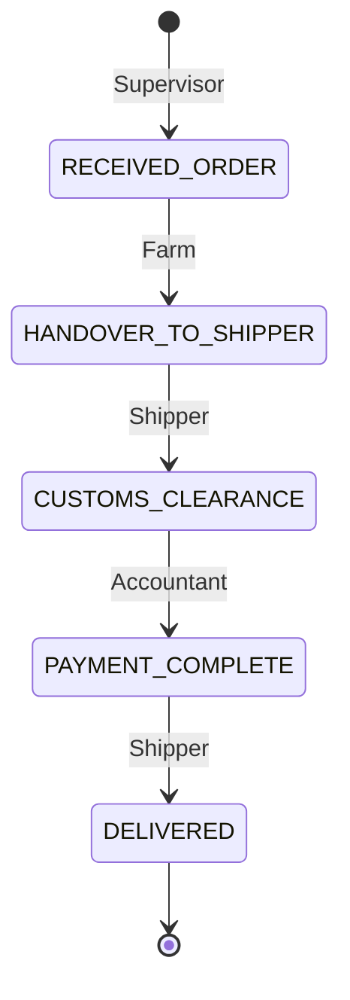

# Multi-Agent Architecture Guide: SLIM Transporter + A2A Protocol + AGNTCY SDK

A comprehensive technical reference for building multi-agent microservices using the **AGNTCY** framework with **SLIM Transporter** and **Agent-to-Agent (A2A) Protocol**, based on analysis of the `corto` and `lungo` coffee agent projects.

---

## Table of Contents

1. [SDK & Library Reference](#sdk--library-reference)
2. [Architecture Overview](#architecture-overview)
3. [SLIM Transporter Configuration](#slim-transporter-configuration)
4. [A2A Protocol Implementation](#a2a-protocol-implementation)
5. [Agent Card Structure](#agent-card-structure)
6. [AgntcyFactory Pattern](#agntcyfactory-pattern)
7. [Communication Patterns](#communication-patterns)
8. [Observability Integration](#observability-integration)
9. [Code Examples](#code-examples)

---

## SDK & Library Reference

### Core Dependencies

| Library | Version | Purpose |
|---------|---------|---------|
| `a2a-sdk` | `0.3.0` | Agent-to-Agent protocol implementation |
| `agntcy-app-sdk` | `0.4.5` | Multi-protocol transport factory, A2A client creation |
| `ioa-observe-sdk` | `1.0.24` | Observability decorators and tracing |
| `langgraph` | `>=0.4.1` | State machine workflow engine |
| `langgraph-supervisor` | `>=0.0.26` | Supervisor pattern utilities |
| `langchain-litellm` | `>=0.3.0` | LLM integration layer |
| `litellm` | `1.75.3` | Multi-provider LLM proxy |
| `agntcy-identity-service-sdk` | `0.0.7` | (Lungo only) Agent identity management |

### Infrastructure Dependencies

| Component | Image/Version | Purpose |
|-----------|---------------|---------|
| SLIM Gateway | `ghcr.io/agntcy/slim:0.6.1` | Message broker for A2A transport |
| OpenTelemetry Collector | `otel/opentelemetry-collector-contrib:latest` | Telemetry collection |
| ClickHouse | `clickhouse/clickhouse-server` | Metrics storage |
| Grafana | `grafana/grafana` | Observability dashboards |
| MCE API | `ghcr.io/agntcy/obs-api:0.1.1` | Observability API layer |
| MCE Engine | `ghcr.io/agntcy/mce:1.2.1` | Metrics computation engine |

---

## Architecture Overview



### Agent Types

| Agent Type | Role | Communication Pattern |
|------------|------|----------------------|
| **Supervisor** | Orchestrates workflow, dispatches tasks | Client (sends to group) |
| **Worker (Farm/Shipper/Accountant)** | Executes specific skill | Server (receives and responds) |
| **Helpdesk** | Observer agent for monitoring | Listener (group participant) |

---

## SLIM Transporter Configuration

### Server Configuration (`config/docker/slim/server-config.yaml`)

```yaml
tracing:
  log_level: info
  display_thread_names: true
  display_thread_ids: true

runtime:
  n_cores: 0
  thread_name: "slim-data-plane"
  drain_timeout: 10s

services:
  slim/0:
    dataplane:
      servers:
        - endpoint: "0.0.0.0:46357"
          tls:
            insecure: true
      clients: []
    controller:
      servers:
        - endpoint: "0.0.0.0:46358"
          tls:
            insecure: true
```

### Environment Variables

```bash
# Transport Configuration
DEFAULT_MESSAGE_TRANSPORT=SLIM
TRANSPORT_SERVER_ENDPOINT=http://slim:46357

# Security (development only)
SLIM_GATEWAY_PASSWORD=dummy_password

# Observability
OTLP_HTTP_ENDPOINT=http://otel-collector:4318
```

### Docker Compose Service Definition

```yaml
slim:
  image: ghcr.io/agntcy/slim:0.6.1
  container_name: slim-lungo
  ports:
    - "46357:46357"
  environment:
    - PASSWORD=${SLIM_GATEWAY_PASSWORD:-dummy_password}
    - CONFIG_PATH=/config.yaml
  volumes:
    - ./config/docker/slim/server-config.yaml:/config.yaml
  command: ["/slim", "--config", "/config.yaml"]
```

---

## A2A Protocol Implementation

### Core A2A Types (from `a2a-sdk`)

```python
from a2a.types import (
    AgentCard,              # Agent identity and capabilities
    AgentCapabilities,      # Streaming, push notifications
    AgentSkill,             # Skill definition with examples
    SendMessageRequest,     # Request wrapper
    MessageSendParams,      # Message parameters
    Message,                # Core message type
    Part,                   # Message part container
    TextPart,               # Text content part
    Role,                   # user/agent role enum
)

from a2a.server.apps import A2AStarletteApplication
from a2a.server.request_handlers import DefaultRequestHandler
from a2a.server.tasks import InMemoryTaskStore
from a2a.server.agent_execution import AgentExecutor, RequestContext
from a2a.server.events import EventQueue
from a2a.utils import new_agent_text_message, new_task
```

### Message Construction

```python
from uuid import uuid4

request = SendMessageRequest(
    id=str(uuid4()),
    params=MessageSendParams(
        message=Message(
            messageId=str(uuid4()),
            role=Role.user,
            parts=[
                Part(
                    TextPart(
                        text="RECEIVED_ORDER | Supervisor -> Farm: Create order 12345"
                    )
                )
            ],
        )
    ),
)
```

### Response Handling

```python
response = await client.send_message(request)

if response.root.result:
    if response.root.result.parts:
        part = response.root.result.parts[0].root
        if hasattr(part, "text"):
            result = part.text
elif response.root.error:
    raise Exception(f"A2A error: {response.root.error.message}")
```

---

## Agent Card Structure

### Complete AgentCard Definition

```python
from a2a.types import AgentCapabilities, AgentCard, AgentSkill

AGENT_SKILL = AgentSkill(
    id="get_shipping_status",
    name="Get Shipping Status",
    description="Returns the shipping status of coffee beans from the farms.",
    tags=["coffee", "shipping"],
    examples=[
        "Advance the order from HANDOVER_TO_SHIPPER to CUSTOMS_CLEARANCE.",
        "What is the current shipping status?",
    ]
)

AGENT_CARD = AgentCard(
    name='Shipping agent',
    id='shipping-agent',
    description='An AI agent that ships coffee beans and sends status updates.',
    url='',  # Empty for SLIM transport
    version='1.0.0',
    defaultInputModes=["text"],
    defaultOutputModes=["text"],
    capabilities=AgentCapabilities(streaming=True),
    skills=[AGENT_SKILL],
    supportsAuthenticatedExtendedCard=False,
)
```

### Topic Generation from Agent Card

```python
from agntcy_app_sdk.semantic.a2a.protocol import A2AProtocol

# Generate routable topic from agent card
topic = A2AProtocol.create_agent_topic(AGENT_CARD)
# Result: "shipping-agent" (uses card.id)
```

---

## AgntcyFactory Pattern

### Factory Initialization

```python
from agntcy_app_sdk.factory import AgntcyFactory

# Initialize with service name and tracing
factory = AgntcyFactory("lungo.logistics_supervisor", enable_tracing=True)
```

### Shared Factory Pattern (Singleton)

```python
# shared.py
from typing import Optional
from agntcy_app_sdk.factory import AgntcyFactory

_factory: Optional[AgntcyFactory] = None

def set_factory(factory: AgntcyFactory):
    global _factory
    _factory = factory

def get_factory() -> AgntcyFactory:
    if _factory is None:
        return AgntcyFactory("lungo.logistics_supervisor", enable_tracing=True)
    return _factory

# main.py - On startup
shared.set_factory(AgntcyFactory("lungo.logistics_supervisor", enable_tracing=True))
```

### Transport Creation

```python
from agntcy_app_sdk.semantic.a2a.protocol import A2AProtocol

# Create transport for SLIM
transport = factory.create_transport(
    "SLIM",  # Transport type (SLIM, NATS, A2A)
    endpoint="http://slim:46357",  # SLIM server endpoint
    name="default/default/logistic_graph"  # Routable name: org/namespace/agent
)
```

### A2A Client Creation

```python
# Create A2A client for sending messages
client = await factory.create_client(
    "A2A",  # Protocol
    agent_topic=A2AProtocol.create_agent_topic(SHIPPER_CARD),  # Target agent
    transport=transport,  # Transport layer
)
```

---

## Communication Patterns

### Pattern 1: Point-to-Point (Corto)

**Supervisor → Single Worker → Response**

```python
# exchange/agent.py - Supervisor sending to Farm Agent
async def a2a_client_send_message(self, prompt: str):
    factory = self.factory
    a2a_topic = A2AProtocol.create_agent_topic(farm_agent_card)
    
    transport = factory.create_transport(
        DEFAULT_MESSAGE_TRANSPORT,
        endpoint=TRANSPORT_SERVER_ENDPOINT,
        name="default/default/exchange"
    )
    
    client = await factory.create_client(
        "A2A",
        agent_topic=a2a_topic,
        transport=transport
    )

    request = SendMessageRequest(
        id=str(uuid4()),
        params=MessageSendParams(
            message=Message(
                message_id=str(uuid4()),
                role=Role.user,
                parts=[Part(TextPart(text=prompt))],
            )
        )
    )

    response = await client.send_message(request)
    return response.root.result.parts[0].root.text
```

### Pattern 2: Group Chat (Lungo)

**Supervisor → Broadcast to Multiple Workers → Collect Responses**

```python
# tools.py - Group conversation broadcast
async def create_order(farm: str, quantity: int, price: float) -> str:
    client = await factory.create_client(
        "A2A",
        agent_topic=A2AProtocol.create_agent_topic(SHIPPER_CARD),
        transport=transport,
    )

    request = SendMessageRequest(
        id=str(uuid4()),
        params=MessageSendParams(
            message=Message(
                messageId=str(uuid4()),
                role=Role.user,
                parts=[
                    Part(
                        TextPart(
                            text=f"RECEIVED_ORDER | Supervisor -> Farm: Create order {uuid4().hex}"
                        )
                    )
                ],
            )
        ),
    )

    # Define group participants
    recipients = [
        A2AProtocol.create_agent_topic(SHIPPER_CARD),
        A2AProtocol.create_agent_topic(TATOOINE_CARD),
        A2AProtocol.create_agent_topic(ACCOUNTANT_CARD),
    ]

    # Start group chat with termination condition
    responses = await client.start_groupchat(
        init_message=request,
        group_channel=f"{uuid4()}",
        participants=recipients,
        end_message="DELIVERED",  # Termination keyword
        timeout=60,
    )

    return _summarize_a2a_responses(responses)
```

### Pattern 3: Streaming Group Chat

```python
async def create_order_streaming(farm: str, quantity: int, price: float):
    """Yields responses as they arrive from agents."""
    
    responses = client.start_streaming_groupchat(
        init_message=request,
        group_channel=f"{uuid4()}",
        participants=recipients,
        end_message="DELIVERED",
        timeout=60,
    )
    
    async for response in responses:
        if "idle" not in str(response).lower():
            parsed_event = _parse_order_event(response)
            if parsed_event:
                yield parsed_event
```

### Worker Agent Server Setup

```python
# server.py - Skill agent as A2A server
from agntcy_app_sdk.app_sessions import AppContainer

async def run_transport(server, transport_type, endpoint):
    personal_topic = A2AProtocol.create_agent_topic(AGENT_CARD)
    
    transport = factory.create_transport(
        transport_type,
        endpoint=endpoint,
        name=f"default/default/{personal_topic}"
    )
    
    app_session = factory.create_app_session(max_sessions=1)

    # Add container for group communication
    app_session.add_app_container("group_session", AppContainer(
        server,
        transport=transport
    ))

    await app_session.start_session("group_session")
```

---

## State Machine & Message Format

### Logistics Status Workflow



### Status Enum Definition

```python
from enum import Enum

class LogisticsStatus(Enum):
    RECEIVED_ORDER = "RECEIVED_ORDER"
    HANDOVER_TO_SHIPPER = "HANDOVER_TO_SHIPPER"
    CUSTOMS_CLEARANCE = "CUSTOMS_CLEARANCE"
    PAYMENT_COMPLETE = "PAYMENT_COMPLETE"
    DELIVERED = "DELIVERED"
    STATUS_UNKNOWN = "STATUS_UNKNOWN"
```

### Message Format Convention

```
{STATUS} | {Sender} -> {Receiver}: {Message Details}
```

**Examples:**
```
RECEIVED_ORDER | Supervisor -> Tatooine Farm: Create order abc123 with price 3.52 and quantity 5000.
HANDOVER_TO_SHIPPER | Tatooine Farm -> Shipper: Order abc123 handed off for international transit.
CUSTOMS_CLEARANCE | Shipper -> Accountant: Customs cleared for order abc123; documents forwarded for payment processing.
PAYMENT_COMPLETE | Accountant -> Shipper: Payment confirmed on order abc123; preparing final delivery.
DELIVERED | Shipper -> Supervisor: Order abc123 delivered successfully; closing shipment cycle.
```

---

## Observability Integration

### Tracing Decorators (ioa-observe-sdk)

```python
from ioa_observe.sdk.decorators import agent, graph
from ioa_observe.sdk.tracing import session_start

@agent(name="shipper_agent")
class ShipperAgent:
    def __init__(self):
        self.app = self._build_graph()

    @graph(name="shipper_graph")
    def _build_graph(self):
        workflow = StateGraph(GraphState)
        # ... build workflow
        return workflow.compile()

# In API endpoint
@app.post("/agent/prompt")
async def handle_prompt(request: PromptRequest):
    session_start()  # Start new tracing session
    result = await agent.execute(request.prompt)
    return {"response": result}
```

### Factory Tracing

```python
# Enable tracing in factory
factory = AgntcyFactory("lungo.logistics_supervisor", enable_tracing=True)
```

### OpenTelemetry Collector Configuration

```yaml
# otel-collector-config.yaml
receivers:
  otlp:
    protocols:
      grpc:
        endpoint: 0.0.0.0:4317
      http:
        endpoint: 0.0.0.0:4318

exporters:
  clickhouse:
    endpoint: http://clickhouse-server:8123
    database: default
    username: admin
    password: admin

service:
  pipelines:
    traces:
      receivers: [otlp]
      exporters: [clickhouse]
    metrics:
      receivers: [otlp]
      exporters: [clickhouse]
```

### Docker Compose Observability Stack

```yaml
otel-collector:
  image: otel/opentelemetry-collector-contrib:latest
  ports:
    - "4317:4317"  # gRPC
    - "4318:4318"  # HTTP
  volumes:
    - ./config/docker/otel/otel-collector-config.yaml:/etc/otel-collector-config.yaml
  command: ["--config", "/etc/otel-collector-config.yaml"]

clickhouse-server:
  image: clickhouse/clickhouse-server
  ports:
    - "9000:9000"
    - "8123:8123"
  environment:
    CLICKHOUSE_USER: admin
    CLICKHOUSE_PASSWORD: admin

grafana:
  image: grafana/grafana
  ports:
    - "3001:3000"
  environment:
    - GF_INSTALL_PLUGINS=grafana-clickhouse-datasource
```

---

## AgentExecutor Pattern

### Complete Worker Agent Executor

```python
from a2a.server.agent_execution import AgentExecutor, RequestContext
from a2a.server.events import EventQueue
from a2a.utils import new_task
from a2a.types import Message, Role, Part, TextPart

class ShipperAgentExecutor(AgentExecutor):
    def __init__(self):
        self.agent = ShipperAgent()
        self.agent_card = AGENT_CARD.model_dump(mode="json", exclude_none=True)

    def _validate_request(self, context: RequestContext):
        if not context or not context.message or not context.message.parts:
            return JSONRPCResponse(error=ContentTypeNotSupportedError())
        return None

    async def execute(
        self,
        context: RequestContext,
        event_queue: EventQueue,
    ) -> None:
        validation_error = self._validate_request(context)
        if validation_error:
            await event_queue.enqueue_event(validation_error)
            return

        prompt = context.get_user_input()
        task = context.current_task
        if not task:
            task = new_task(context.message)
            await event_queue.enqueue_event(task)

        try:
            output = await self.agent.ainvoke(prompt)

            message = Message(
                message_id=str(uuid4()),
                role=Role.agent,
                metadata={"name": self.agent_card["name"]},
                parts=[Part(TextPart(text=output))],
            )

            await event_queue.enqueue_event(message)
        except Exception as e:
            raise ServerError(error=InternalError()) from e

    async def cancel(self, request: RequestContext, event_queue: EventQueue):
        raise ServerError(error=UnsupportedOperationError())
```

---

## LangGraph Integration

### Skill Agent Graph Structure

```python
from langgraph.graph import StateGraph, END, MessagesState
from langchain_core.messages import AIMessage
from ioa_observe.sdk.decorators import agent, graph

@agent(name="shipper_agent")
class ShipperAgent:
    def __init__(self):
        self.app = self._build_graph()

    def _shipper_node(self, state: GraphState) -> dict:
        messages = state["messages"]
        last_message = messages[-1]
        text = getattr(last_message, "content", str(last_message))
        
        status = extract_status(text)
        order_id = ensure_order_id(text)

        if status is LogisticsStatus.HANDOVER_TO_SHIPPER:
            msg = build_transition_message(
                order_id=order_id,
                sender="Shipper",
                receiver="Accountant",
                to_state=LogisticsStatus.CUSTOMS_CLEARANCE.value,
            )
            return {"messages": [AIMessage(msg)]}

        if status is LogisticsStatus.PAYMENT_COMPLETE:
            msg = build_transition_message(
                order_id=order_id,
                sender="Shipper",
                receiver="Supervisor",
                to_state=LogisticsStatus.DELIVERED.value,
            )
            return {"messages": [AIMessage(msg)]}

        return {"messages": [AIMessage("Shipper remains IDLE.")]}

    @graph(name="shipper_graph")
    def _build_graph(self):
        workflow = StateGraph(GraphState)
        workflow.add_node("shipper", self._shipper_node)
        workflow.set_entry_point("shipper")
        workflow.add_edge("shipper", END)
        return workflow.compile()

    async def ainvoke(self, user_message: str) -> str:
        inputs = {"messages": [user_message]}
        result = await self.app.ainvoke(inputs)
        return result["messages"][-1].content
```

---

## Complete Server Startup Flow

### Worker Agent Server

```python
import asyncio
from a2a.server.apps import A2AStarletteApplication
from a2a.server.tasks import InMemoryTaskStore
from a2a.server.request_handlers import DefaultRequestHandler
from agntcy_app_sdk.factory import AgntcyFactory
from agntcy_app_sdk.semantic.a2a.protocol import A2AProtocol
from agntcy_app_sdk.app_sessions import AppContainer

factory = AgntcyFactory("lungo.logistics_shipper", enable_tracing=True)

async def main():
    # 1. Create request handler with executor
    request_handler = DefaultRequestHandler(
        agent_executor=ShipperAgentExecutor(),
        task_store=InMemoryTaskStore(),
    )

    # 2. Create A2A Starlette application
    server = A2AStarletteApplication(
        agent_card=AGENT_CARD,
        http_handler=request_handler
    )

    # 3. Create transport
    personal_topic = A2AProtocol.create_agent_topic(AGENT_CARD)
    transport = factory.create_transport(
        "SLIM",
        endpoint="http://slim:46357",
        name=f"default/default/{personal_topic}"
    )

    # 4. Create app session for group communication
    app_session = factory.create_app_session(max_sessions=1)
    app_session.add_app_container("group_session", AppContainer(
        server,
        transport=transport
    ))

    # 5. Start session (blocking)
    await app_session.start_session("group_session")

if __name__ == '__main__':
    asyncio.run(main())
```

---

## Quick Reference: Key Methods

| Class/Module | Method | Purpose |
|--------------|--------|---------|
| `AgntcyFactory` | `create_transport(type, endpoint, name)` | Create transport layer |
| `AgntcyFactory` | `create_client(protocol, agent_topic, transport)` | Create A2A client |
| `AgntcyFactory` | `create_app_session(max_sessions)` | Create session manager |
| `A2AProtocol` | `create_agent_topic(agent_card)` | Generate routable topic |
| `client` | `send_message(request)` | Point-to-point message |
| `client` | `start_groupchat(init_message, participants, ...)` | Broadcast to group |
| `client` | `start_streaming_groupchat(...)` | Streaming group chat |
| `app_session` | `add_app_container(name, container)` | Register agent container |
| `app_session` | `start_session(name, keep_alive)` | Start listening |
| `event_queue` | `enqueue_event(message)` | Send response |

---

## Project Structure Reference

### Corto (Simple P2P)
```
corto/
├── farm/
│   ├── agent.py           # FarmAgent with LangGraph
│   ├── agent_executor.py  # A2A AgentExecutor
│   ├── card.py            # AgentCard definition
│   └── farm_server.py     # A2A server startup
├── exchange/
│   ├── agent.py           # Supervisor with A2A client
│   └── main.py            # FastAPI endpoints
├── config/
│   └── config.py          # Environment config
└── docker-compose.yaml
```

### Lungo (Group Chat)
```
lungo/
├── agents/
│   ├── supervisors/
│   │   └── logistic/
│   │       ├── main.py    # FastAPI supervisor
│   │       └── graph/
│   │           ├── graph.py   # Orchestration workflow
│   │           ├── tools.py   # A2A groupchat tools
│   │           └── shared.py  # Factory singleton
│   └── logistics/
│       ├── shipper/
│       │   ├── agent.py
│       │   ├── agent_executor.py
│       │   ├── card.py
│       │   └── server.py
│       ├── farm/
│       ├── accountant/
│       └── helpdesk/
├── common/
│   └── logistics_states.py  # Status enum & formatting
├── config/
│   ├── config.py
│   └── docker/slim/server-config.yaml
└── docker-compose.yaml
```

---

## Environment Configuration Summary

```bash
# Transport (SLIM)
DEFAULT_MESSAGE_TRANSPORT=SLIM
TRANSPORT_SERVER_ENDPOINT=http://slim:46357
SLIM_GATEWAY_PASSWORD=your_password

# Observability
OTLP_HTTP_ENDPOINT=http://otel-collector:4318

# LLM (choose one provider)
OPENAI_API_KEY=sk-xxx
# OR
AZURE_API_BASE=https://xxx.openai.azure.com
AZURE_API_KEY=xxx
# OR
OPENROUTER_API_KEY=sk-or-xxx

# Agent-specific
ENABLE_HTTP=true
LOGISTIC_TIMEOUT=200
```

---

*This document provides the complete technical foundation for implementing your own multi-agent microservices architecture using SLIM Transporter and A2A Protocol.*
