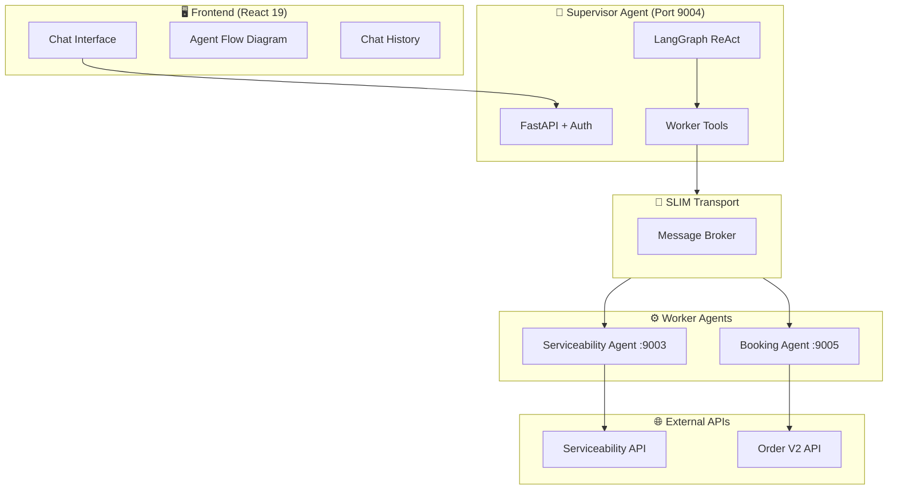
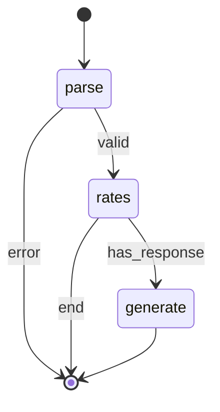
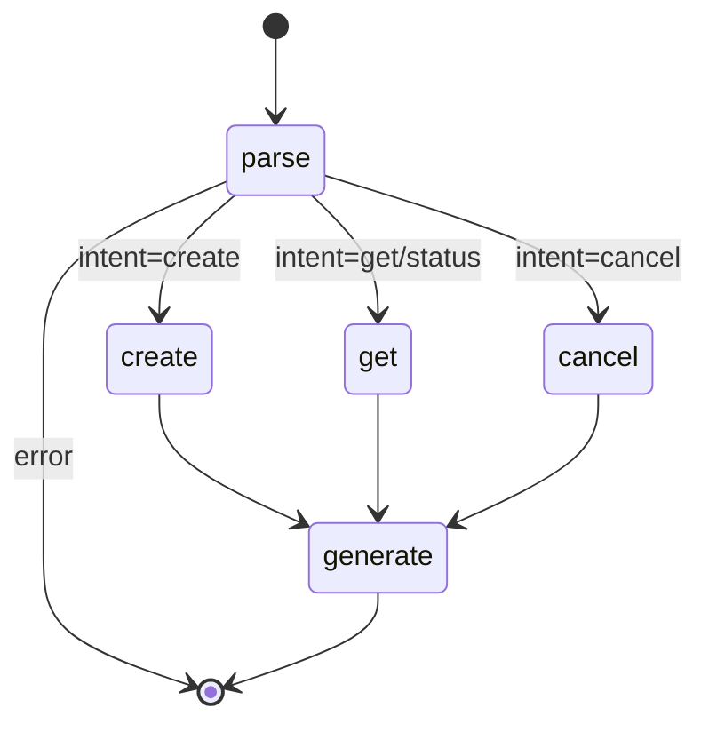
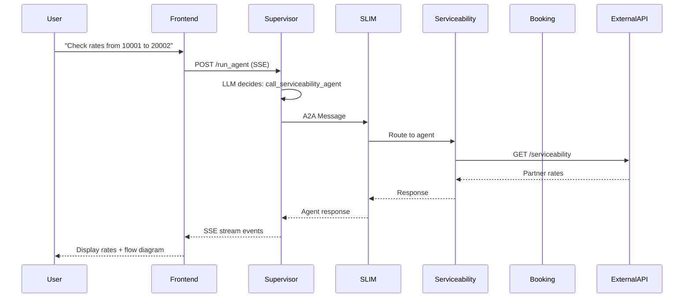

# Agentic Orchestrator - Project Documentation

> A multi-agent logistics orchestration system built on the **AGNTCY framework** with **LangGraph** state machines, **SLIM transport**, and a modern **React** frontend.

---

## 🎯 Project Overview

This project implements a **multi-agent AI orchestration system** for logistics operations. It enables natural language interactions for:

- **Serviceability Checking** – Verify shipping routes, rates, and carrier availability
- **Order Booking** – Create, track, and cancel shipment orders
- **Intelligent Routing** – Supervisor agent orchestrates specialized worker agents



---

## 🏗️ Architecture & Components

### 1. Supervisor Agent

| Aspect | Details |
|--------|---------|
| **Port** | 9004 |
| **Framework** | FastAPI + LangGraph |
| **Role** | Orchestrates requests, routes to workers |
| **Auth** | JWT-based with PostgreSQL (RDS) |
| **LLM** | OpenRouter (configurable via `SUPERVISOR_LLM`) |

**Key Files:**
- [nodes.py](file:///Users/avinash/Developer/Projects/prayog/agentic-orchestrator/src/orchestrator/supervisor_agent/agent/nodes.py) – LangGraph nodes
- [auth.py](file:///Users/avinash/Developer/Projects/prayog/agentic-orchestrator/src/orchestrator/supervisor_agent/app/auth.py) – Authentication service
- [main.py](file:///Users/avinash/Developer/Projects/prayog/agentic-orchestrator/src/orchestrator/supervisor_agent/app/main.py) – FastAPI app

**Capabilities:**
- ✅ Tool-based worker invocation
- ✅ Context-aware conversation
- ✅ Rate limit error handling
- ✅ User authentication (register/login)
- ✅ Chat history persistence

---

### 2. Serviceability Agent

| Aspect | Details |
|--------|---------|
| **Port** | 9003 |
| **Framework** | LangGraph State Machine |
| **Role** | Check shipping rates and carrier availability |
| **Transport** | SLIM + HTTP (dual mode) |
| **External API** | `SERVICEABILITY_API_URL` |

**Workflow Graph:**


**Domain Models:**
- `ServiceabilityRequest` – Origin/dest locations, packages
- `Partner` – Carrier details (code, services, rates)
- `ServiceabilityResponse` – Aggregated results

---

### 3. Booking Agent

| Aspect | Details |
|--------|---------|
| **Port** | 9005 |
| **Framework** | LangGraph State Machine |
| **Role** | Create, get, cancel orders |
| **Transport** | SLIM + HTTP (dual mode) |
| **External API** | Order V2 API |

**Workflow Graph:**


**Domain Models:**
- `Address` – Pickup/delivery addresses
- `Shipment` – AWB, weight, dimensions
- `Payment` – Type, amount, status
- `Order` – Complete order structure

---

### 4. Frontend Application

| Aspect | Details |
|--------|---------|
| **Framework** | React 19 + TypeScript |
| **Build Tool** | Vite 7 |
| **Styling** | TailwindCSS 4 |
| **State** | Zustand |
| **Visualization** | @xyflow/react (Agent Flow) |
| **Storage** | Dexie (IndexedDB) |

**Key Features:**
- 💬 Chat interface with streaming responses
- 🔄 Real-time agent flow visualization
- 📜 Cross-device chat history sync
- 🌗 Dark/Light theme support
- 🔐 Authentication (login/register)
- 📱 Responsive resizable panels

**Store Architecture:**
- `chatHistoryStore` – Conversations and messages
- `orchestratorStreamingStore` – Real-time agent events

---

## 🛠️ Technology Stack

### Backend

| Technology | Version | Purpose |
|------------|---------|---------|
| Python | 3.12+ | Runtime |
| LangGraph | ≥0.2.0 | State machine workflows |
| LangChain | ≥0.3.0 | LLM integration |
| LiteLLM | ≥1.50.0 | Multi-provider LLM proxy |
| FastAPI | ≥0.115.0 | HTTP API framework |
| Pydantic | ≥2.0 | Data validation |
| OpenTelemetry | ≥1.27.0 | Observability (disabled) |
| AGNTCY SDK | - | Agent transport (SLIM) |
| A2A Protocol | - | Agent-to-agent communication |

### Frontend

| Technology | Version | Purpose |
|------------|---------|---------|
| React | 19.2.0 | UI framework |
| TypeScript | 5.9.3 | Type safety |
| Vite | 7.2.4 | Build tool |
| TailwindCSS | 4.1.17 | Styling |
| Zustand | 5.0.9 | State management |
| @xyflow/react | 12.10.0 | Flow diagrams |
| Dexie | 4.0.10 | IndexedDB wrapper |
| Axios | 1.13.2 | HTTP client |

### Infrastructure

| Component | Details |
|-----------|---------|
| **Transport** | SLIM (EC2: 3.7.70.176:46357) |
| **Database** | PostgreSQL on AWS RDS |
| **Container** | Docker + Docker Compose |
| **CI/CD** | Jenkins pipelines |
| **Registry** | AWS ECR |
| **Hosting** | AWS ECS (Fargate) |

---

## ✅ Achievements & Features

### Agent System
- [x] Multi-agent supervisor-worker topology
- [x] LangGraph state machine workflows
- [x] SLIM transport for agent communication
- [x] A2A protocol implementation
- [x] Anti-hallucination prompts
- [x] Context-aware routing
- [x] Rate limit error handling
- [x] Retry limits to prevent infinite loops

### Authentication & Persistence
- [x] JWT-based authentication
- [x] User registration/login
- [x] PostgreSQL database (RDS)
- [x] Cross-browser conversation sync
- [x] Chat history persistence

### API Integration
- [x] External Serviceability API
- [x] Order V2 API for bookings
- [x] Partner code extraction
- [x] Real-time rate quotes

### Frontend
- [x] Premium chat UI with streaming
- [x] Real-time agent flow visualization
- [x] Draggable resizable panels
- [x] Dark/Light theme
- [x] Chat history sidebar
- [x] Responsive design

### DevOps
- [x] Docker Compose orchestration
- [x] Jenkins CI/CD pipelines
- [x] AWS ECS deployment
- [x] ECR container registry
- [x] Environment configuration

---

## 📂 Project Structure

```
agentic-orchestrator/
├── src/
│   ├── orchestrator/
│   │   ├── supervisor_agent/     # Main orchestrator
│   │   │   ├── agent/            # LangGraph nodes, state, tools
│   │   │   └── app/              # FastAPI, auth, main
│   │   ├── serviceability_agent/ # Rate/carrier checks
│   │   │   ├── agent/            # Graph, nodes, state
│   │   │   ├── domain/           # Pydantic models
│   │   │   └── services/         # External API client
│   │   └── booking_agent/        # Order management
│   │       ├── agent/            # Graph, nodes, state
│   │       ├── domain/           # Order models
│   │       └── services/         # Order API client
│   └── frontend/                 # React application
│       └── src/
│           ├── components/       # UI components
│           ├── stores/           # Zustand stores
│           └── types/            # TypeScript types
├── config/
│   ├── docker/                   # Docker configs
│   └── slim/                     # SLIM transport config
├── docs/                         # Architecture guides
├── docker-compose.yml            # Service orchestration
└── pyproject.toml                # Python dependencies
```

---

## 🚀 Running the Project

### Local Development

```bash
# Start all services
docker-compose up --build

# Services:
# - Frontend: http://localhost:3000
# - Supervisor: http://localhost:9004
# - Serviceability: http://localhost:9003
# - Booking: http://localhost:9005
```

### Environment Variables

| Variable | Description |
|----------|-------------|
| `SUPERVISOR_LLM` | LLM model for supervisor |
| `OPENROUTER_API_KEY` | OpenRouter API key |
| `DATABASE_URL` | PostgreSQL connection |
| `SLIM_ENDPOINT` | SLIM transport URL |
| `SERVICEABILITY_API_URL` | External rates API |
| `ORDER_API_URL` | Order V2 API |

---

## 📊 Communication Flow



---

## 🔮 Future Roadmap

- [ ] AGNTCY Identity Service integration
- [ ] Kubernetes deployment
- [ ] Advanced TBAC policies
- [ ] Real carrier API integrations
- [ ] Human-in-the-loop (HITL) for high-value orders
- [ ] OpenTelemetry observability (re-enable)

---

*Generated on December 25, 2024*
