# Lungo Project - Comprehensive Architecture Documentation

## Table of Contents
1. [Overview](#overview)
2. [High-Level Design (HLD)](#high-level-design-hld)
3. [Low-Level Design (LLD)](#low-level-design-lld)
4. [Services Description](#services-description)
5. [Communication Patterns](#communication-patterns)
6. [Class Diagrams](#class-diagrams)
7. [Coding Standards](#coding-standards)
8. [Data Flow](#data-flow)

---

## Overview

The **Lungo Demo** is a supervisor-worker agent ecosystem that demonstrates interoperable open-source agentic components from the AGNTCY project. It models a coffee exchange platform where:

- **Supervisor Agent (Exchange)**: Acts as a Coffee Exchange, managing inventory and fulfilling orders
- **Worker Agents (Farms)**: Represent Coffee Farms (Brazil, Colombia, Vietnam) that supply inventory and process orders

### Key Technologies
- **LangGraph**: For building directed agent workflows with state machines
- **AGNTCY App SDK**: For A2A (Agent-to-Agent) communication
- **SLIM/NATS**: Transport layer for message passing
- **FastAPI**: HTTP API layer
- **LiteLLM**: LLM provider abstraction
- **OpenTelemetry**: Observability and tracing

---

## High-Level Design (HLD)

### System Architecture

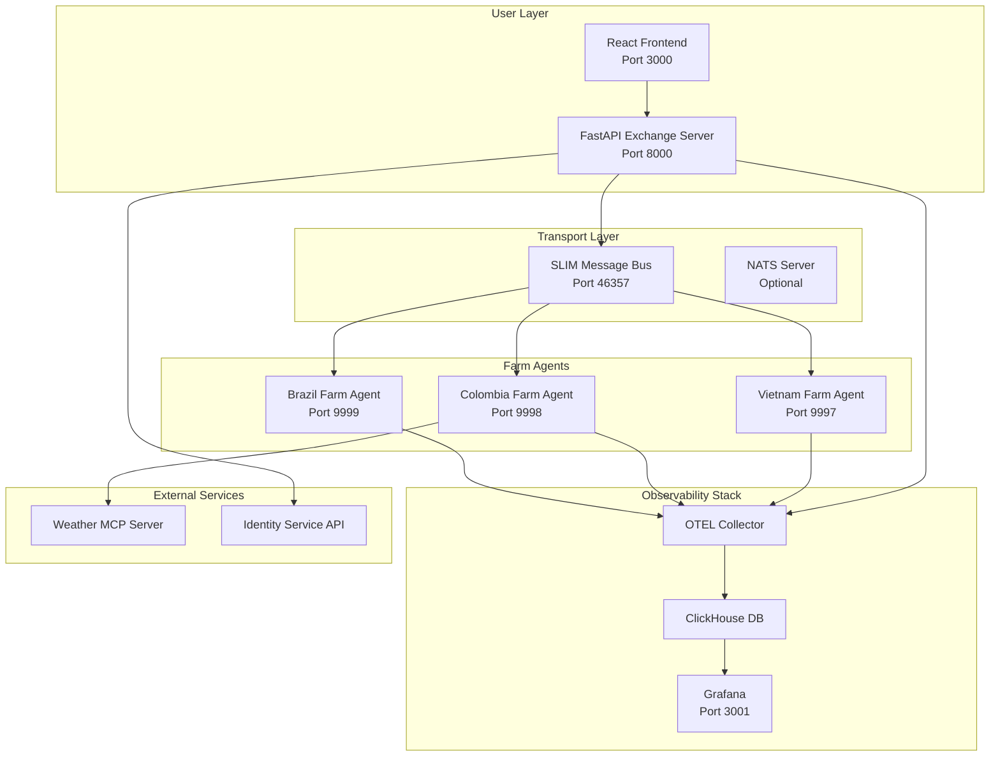

### Component Responsibilities

| Component | Responsibility |
|-----------|---------------|
| **Exchange Server** | Receives user prompts, routes via LangGraph, orchestrates farm communication |
| **Brazil Farm** | Handles inventory/order queries for Brazil coffee operations |
| **Colombia Farm** | Handles Colombia operations + MCP client for weather data |
| **Vietnam Farm** | Handles Vietnam coffee operations |
| **SLIM Gateway** | Message bus for A2A communication (unicast + broadcast) |
| **Identity Service** | Verifies farm identity badges for order authorization |
| **Weather MCP** | Provides weather-based yield calculations for Colombia |

### Key Design Patterns

1. **Supervisor-Worker Pattern**: Exchange supervises multiple autonomous farm agents
2. **State Machine Pattern**: LangGraph-based workflow with conditional routing
3. **Pub-Sub + Request-Reply**: Hybrid messaging for broadcast and directed communication
4. **Agent Card Discovery**: A2A cards for agent capability advertisement

---

## Low-Level Design (LLD)

### Exchange Server Architecture

```mermaid
flowchart TB
    subgraph "FastAPI Application"
        MAIN[main.py<br/>FastAPI Server]
        PROMPT[/agent/prompt]
        STREAM[/agent/prompt/stream]
        HEALTH[/health]
    end

    subgraph "ExchangeGraph - LangGraph Workflow"
        SUPER[Supervisor Node<br/>Intent Classification]
        INV_SINGLE[Inventory Single Farm]
        INV_ALL[Inventory All Farms<br/>Broadcast]
        ORDERS[Orders Broker]
        REFLECT[Reflection Node]
        GENERAL[General Response]
        TOOLS[ToolNode<br/>create_order, get_order_details]
    end

    subgraph "External Communication"
        A2A_CLIENT[A2A Client]
        TRANSPORT[SLIM Transport]
        FARMS[Farm Agents]
    end

    MAIN --> PROMPT
    MAIN --> STREAM
    PROMPT --> SUPER
    STREAM --> SUPER
    
    SUPER -->|inventory_single_farm| INV_SINGLE
    SUPER -->|inventory_all_farms| INV_ALL
    SUPER -->|orders| ORDERS
    SUPER -->|general| GENERAL
    
    INV_SINGLE --> REFLECT
    INV_ALL --> REFLECT
    ORDERS --> TOOLS
    TOOLS --> ORDERS
    ORDERS --> REFLECT
    REFLECT -->|continue| SUPER
    
    INV_SINGLE --> A2A_CLIENT
    INV_ALL --> A2A_CLIENT
    ORDERS --> A2A_CLIENT
    A2A_CLIENT --> TRANSPORT
    TRANSPORT --> FARMS
```

### Farm Agent Architecture

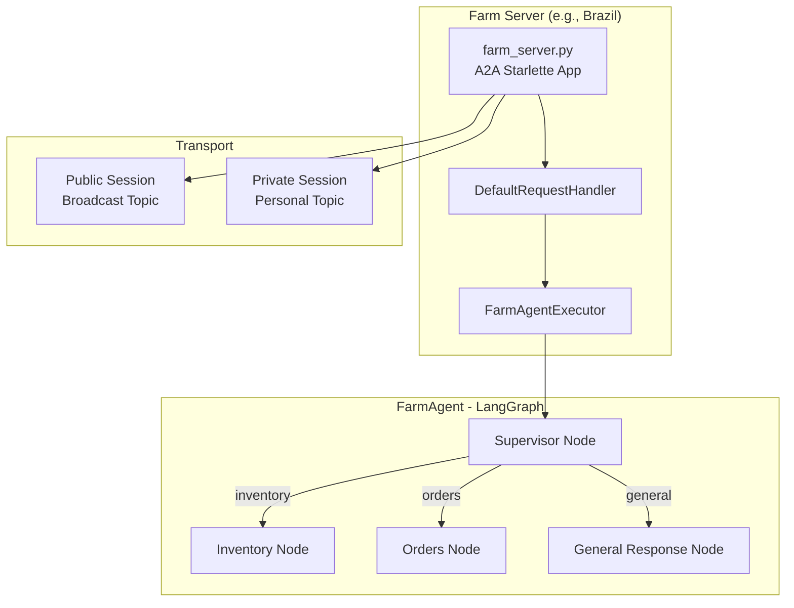

### State Machine Definitions

#### ExchangeGraph State

```python
class GraphState(MessagesState):
    next_node: str          # Routing decision
    full_response: str = "" # Accumulated response for streaming
```

#### Farm GraphState

```python
class GraphState(MessagesState):
    next_node: str  # Routing decision
```

### Node State Constants

```python
# Exchange Graph Nodes
class NodeStates:
    SUPERVISOR = "exchange_supervisor"
    INVENTORY_SINGLE_FARM = "inventory_single_farm"
    INVENTORY_ALL_FARMS = "inventory_all_farms"
    ORDERS = "orders_broker"
    ORDERS_TOOLS = "orders_tools"
    REFLECTION = "reflection"
    GENERAL_INFO = "general"

# Farm Graph Nodes
class NodeStates:
    SUPERVISOR = "supervisor"
    INVENTORY = "inventory_node"
    ORDERS = "orders_node"
    GENERAL_RESPONSE = "general_response_node"
```

---

## Services Description

### 1. Exchange Server Service

**Location**: `agents/supervisors/auction/main.py`

**Purpose**: Main entry point that exposes HTTP endpoints and orchestrates the ExchangeGraph.

**Endpoints**:

| Endpoint | Method | Description |
|----------|--------|-------------|
| `/agent/prompt` | POST | Synchronous prompt processing |
| `/agent/prompt/stream` | POST | Streaming prompt processing (NDJSON) |
| `/.well-known/agent.json` | GET | Agent capabilities card |
| `/health` | GET | Health check |
| `/transport/config` | GET | Current transport configuration |
| `/suggested-prompts` | GET | Sample prompts for UI |

### 2. Farm Agent Services

**Locations**: 
- `agents/farms/brazil/farm_server.py`
- `agents/farms/colombia/farm_server.py`
- `agents/farms/vietnam/farm_server.py`

**Purpose**: A2A servers that process inventory and order requests.

**Transport Sessions**:
- **Public Session**: Listens on broadcast topic (`farm_broadcast`)
- **Private Session**: Listens on personal topic (derived from AgentCard)

### 3. Weather MCP Server

**Location**: `agents/mcp_servers/weather_service.py`

**Purpose**: Provides weather data for yield calculations (used by Colombia farm).

**Integration**: Uses SLIM transport for MCP protocol communication.

### 4. Identity Service

**Location**: `services/identity_service_impl.py`

**Purpose**: Verifies farm identities using badge-based authentication.

**Operations**:
- `get_all_apps()`: Retrieve registered applications
- `get_badge_for_app(app_id)`: Get verification badge
- `verify_badges(badge)`: Validate badge authenticity

---

## Communication Patterns

### Pattern 1: Unicast Communication (Point-to-Point)

Used for single-farm inventory queries and order creation.

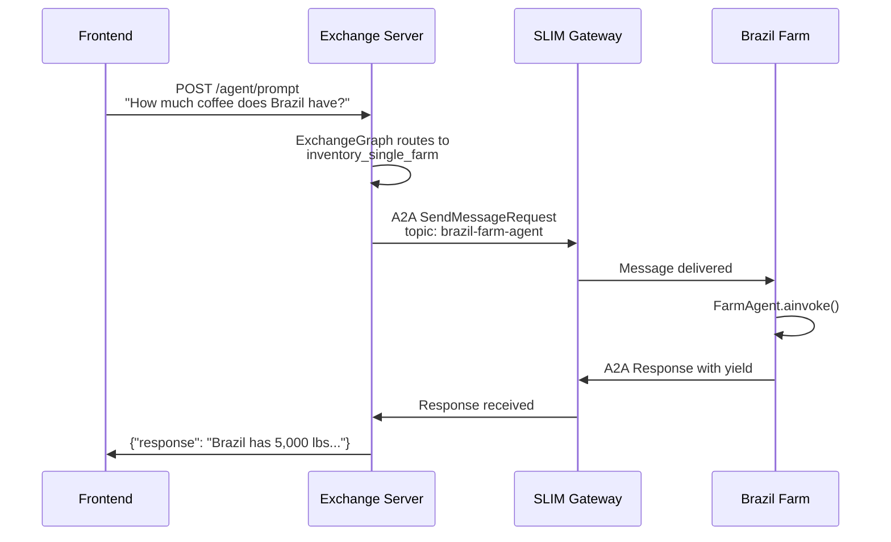

### Pattern 2: Broadcast Communication (Pub-Sub)

Used for querying all farms simultaneously.

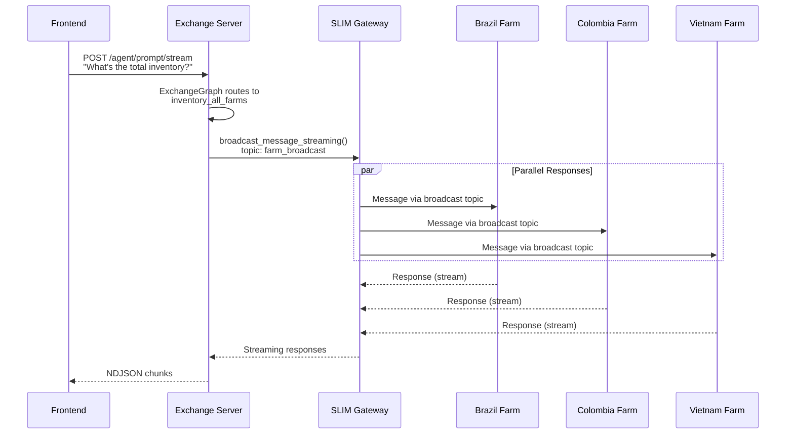

### Pattern 3: Order with Identity Verification

Used for order creation with mandatory identity checks.

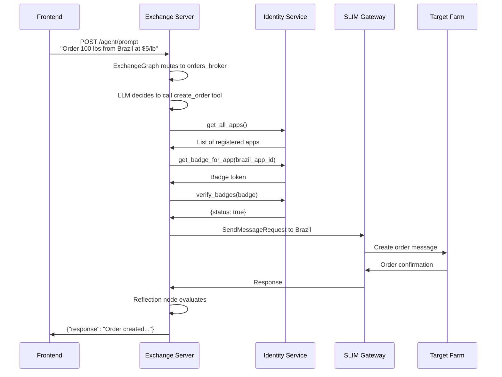

### Transport Configuration

```python
# Default configuration (config.py)
DEFAULT_MESSAGE_TRANSPORT = "NATS"  # or "SLIM"
TRANSPORT_SERVER_ENDPOINT = "nats://localhost:4222"
FARM_BROADCAST_TOPIC = "farm_broadcast"
```

### A2A Protocol Topics

| Agent | Topic Pattern |
|-------|---------------|
| Brazil Farm | `brazil-farm-agent` (from AgentCard) |
| Colombia Farm | `colombia-farm-agent` |
| Vietnam Farm | `vietnam-farm-agent` |
| Broadcast | `farm_broadcast` |

---

## Class Diagrams

### Core Classes - Exchange Layer

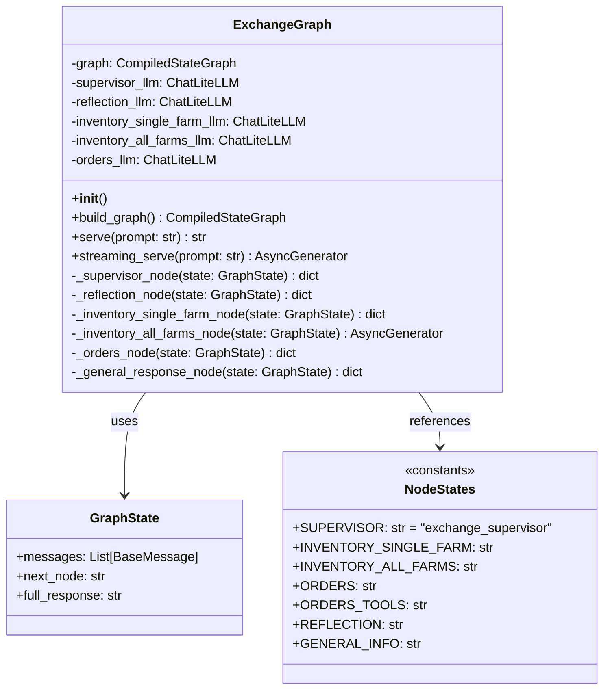

### Core Classes - Farm Layer

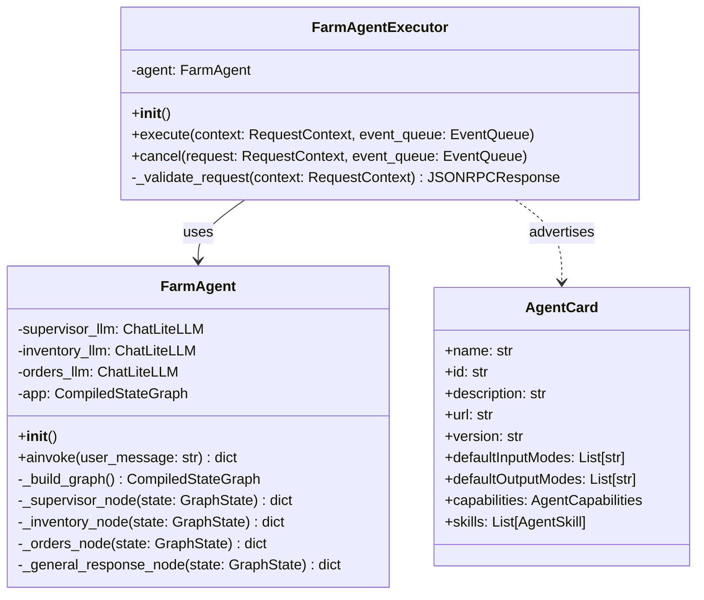

### Communication Classes

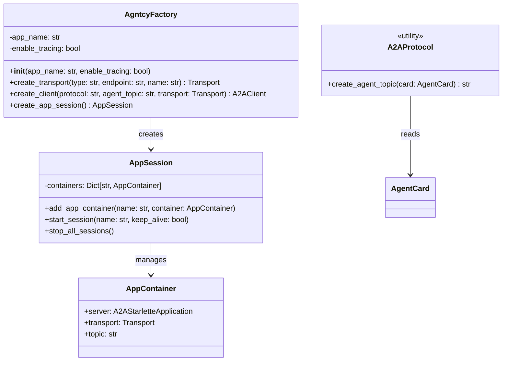

### Tool Classes

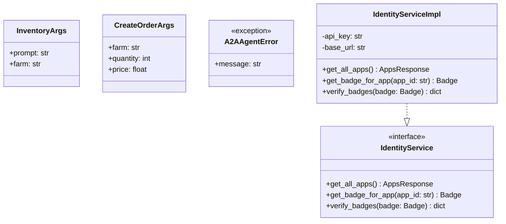

---

## Coding Standards

### 1. File Organization

```
agents/
├── farms/
│   ├── brazil/
│   │   ├── __init__.py
│   │   ├── agent.py          # LangGraph agent logic
│   │   ├── agent_executor.py # A2A executor wrapper
│   │   ├── card.py          # AgentCard definition
│   │   └── farm_server.py   # Server entry point
│   ├── colombia/
│   └── vietnam/
├── supervisors/
│   └── auction/
│       ├── graph/
│       │   ├── graph.py     # ExchangeGraph
│       │   ├── tools.py     # LangChain tools
│       │   ├── models.py    # Pydantic schemas
│       │   └── shared.py    # Shared factory instance
│       └── main.py          # FastAPI server
└── mcp_servers/
    └── weather_service.py
```

### 2. Decorators Used

```python
# Observability decorators from ioa-observe-sdk
@graph(name="exchange_graph")
@agent(name="exchange_agent")
@tool(name="create_order")

# LangChain tool decorator
@tool(args_schema=CreateOrderArgs)
```

### 3. Error Handling Pattern

```python
class A2AAgentError(ToolException):
    """Custom exception for A2A communication errors."""
    pass

try:
    response = await client.send_message(request)
    if response.root.error:
        raise A2AAgentError(f"Error: {response.root.error.message}")
except Exception as e:
    logger.error(f"Communication failed: {e}")
    raise A2AAgentError(f"Details: {e}")
```

### 4. Logging Pattern

```python
import logging
logger = logging.getLogger("lungo.supervisor.graph")

logger.info(f"Processing query: {user_query}")
logger.debug(f"State: {state}")
logger.error(f"Error occurred: {e}")
logger.warning(f"Partial responses received")
```

### 5. Async/Await Pattern

All agent methods use async/await for non-blocking I/O:

```python
async def serve(self, prompt: str) -> str:
    result = await self.graph.ainvoke({...})
    return result

async def streaming_serve(self, prompt: str):
    async for event in self.graph.astream_events(state, ...):
        yield event
```

### 6. Configuration Management

```python
# config/config.py - Centralized environment loading
import os
from dotenv import load_dotenv

load_dotenv()

DEFAULT_MESSAGE_TRANSPORT = os.getenv("DEFAULT_MESSAGE_TRANSPORT", "NATS")
TRANSPORT_SERVER_ENDPOINT = os.getenv("TRANSPORT_SERVER_ENDPOINT", "nats://localhost:4222")
LLM_MODEL = os.getenv("LLM_MODEL", "")
```

---

## Data Flow

### Request Processing Flow

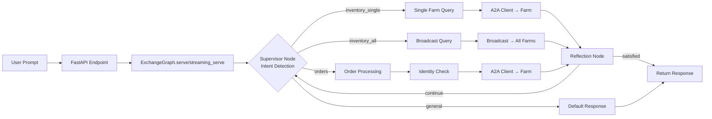

### Message Format

```python
# A2A Request Structure
SendMessageRequest(
    id=str(uuid4()),
    params=MessageSendParams(
        message=Message(
            messageId=str(uuid4()),
            role=Role.user,
            parts=[Part(TextPart(text=prompt))],
        )
    )
)

# Response Handling
if response.root.result and response.root.result.parts:
    part = response.root.result.parts[0].root
    return part.text.strip()
```

---

## Deployment Architecture

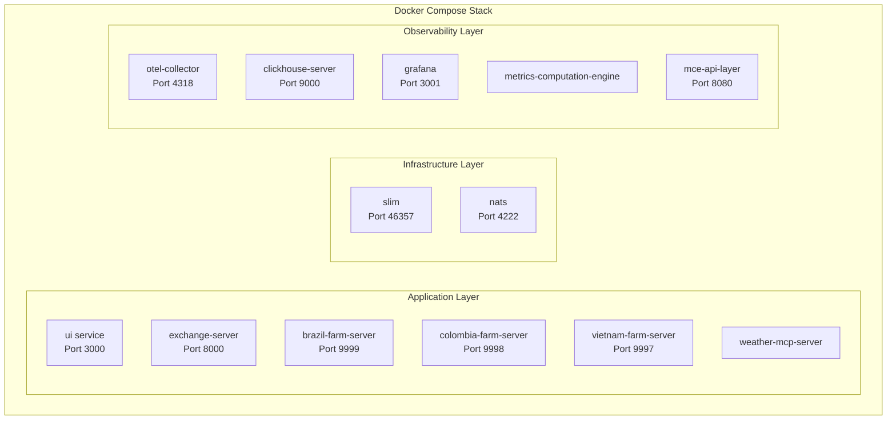

---

## Summary

The Lungo project demonstrates a sophisticated multi-agent architecture with:

1. **Hierarchical Agent Design**: Supervisor-worker pattern for scalable orchestration
2. **Flexible Communication**: Support for both unicast and broadcast messaging
3. **State Machine Workflows**: LangGraph-based deterministic routing with reflection loops
4. **Security Integration**: Identity verification for sensitive operations
5. **Observability**: Full tracing and metrics via OpenTelemetry
6. **Extensibility**: Modular design allowing easy addition of new farms/capabilities
