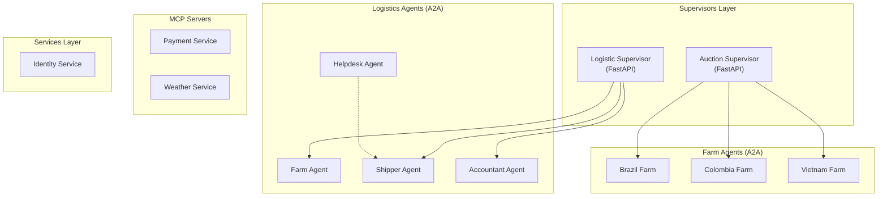

# Lungo Project - Detailed Class Diagram

A comprehensive class diagram of the **Lungo Coffee Agency** multi-agent system.

---

## High-Level Architecture Overview

---

## Detailed Class Diagram

```mermaid
classDiagram
    direction TB

    %% ==========================================
    %% A2A Framework (External Dependencies)
    %% ==========================================
    class AgentExecutor {
        <<interface>>
        +execute(context: RequestContext, event_queue: EventQueue)
        +cancel(request: RequestContext, event_queue: EventQueue)
    }

    class RequestContext {
        +message: Message
        +current_task: Task
        +get_user_input() str
    }

    class EventQueue {
        +enqueue_event(event)
    }

    %% ==========================================
    %% LangGraph State Classes
    %% ==========================================
    class MessagesState {
        <<interface>>
        +messages: List~Message~
    }

    class GraphState {
        +next_node: str
        +full_response: str
    }

    class LogisticGraphState {
        +next_node: str
        +use_streaming: bool
    }

    MessagesState <|-- GraphState
    MessagesState <|-- LogisticGraphState

    %% ==========================================
    %% Farm Agents (Brazil/Colombia/Vietnam)
    %% ==========================================
    class FarmAgent_Brazil {
        -llm
        -graph: CompiledGraph
        +__init__()
        +ainvoke(user_message: str) str
        -_supervisor_node(state: GraphState)
        -_inventory_node(state: GraphState)
        -_orders_node(state: GraphState)
        -_general_response_node(state: GraphState)
        -_build_graph() CompiledGraph
    }

    class FarmAgentExecutor_Brazil {
        +agent: FarmAgent_Brazil
        +agent_card: dict
        +execute(context, event_queue)
        +cancel(request, event_queue)
        -_validate_request(context) JSONRPCResponse
    }

    class NodeStates_Farm {
        <<enumeration>>
        +SUPERVISOR
        +INVENTORY
        +ORDERS
        +GENERAL_RESPONSE
    }

    AgentExecutor <|.. FarmAgentExecutor_Brazil
    FarmAgentExecutor_Brazil --> FarmAgent_Brazil

    %% ==========================================
    %% Supervisor Graphs
    %% ==========================================
    class ExchangeGraph {
        +graph: CompiledGraph
        +__init__()
        +build_graph() CompiledGraph
        +serve(prompt: str) str
        +streaming_serve(prompt: str) AsyncGenerator
        -_supervisor_node(state: GraphState)
        -_reflection_node(state: GraphState)
        -_inventory_single_farm_node(state: GraphState)
        -_inventory_all_farms_node(state: GraphState)
        -_orders_node(state: GraphState)
        -_general_response_node(state: GraphState)
    }

    class LogisticGraph {
        +graph: CompiledGraph
        +__init__()
        +build_graph() CompiledGraph
        +serve(prompt: str) str
        +streaming_serve(prompt: str) AsyncGenerator
        -_orders_node(state: GraphState)
        -_orders_streaming_node(state: GraphState)
    }

    class NodeStates_Exchange {
        <<enumeration>>
        +SUPERVISOR
        +INVENTORY_SINGLE_FARM
        +INVENTORY_ALL_FARMS
        +ORDERS
        +ORDERS_TOOLS
        +REFLECTION
        +GENERAL_INFO
    }

    class NodeStates_Logistic {
        <<enumeration>>
        +ORDERS
        +ORDERS_STREAMING
    }

    ExchangeGraph --> GraphState
    LogisticGraph --> LogisticGraphState

    %% ==========================================
    %% Logistics Agents
    %% ==========================================
    class ShipperAgent {
        +ainvoke(prompt: str) str
    }

    class ShipperAgentExecutor {
        +agent: ShipperAgent
        +agent_card: dict
        +execute(context, event_queue)
        +cancel(request, event_queue)
        -_validate_request(context) JSONRPCResponse
    }

    class AccountantAgent {
        +ainvoke(prompt: str) str
    }

    class AccountantAgentExecutor {
        +agent: AccountantAgent
        +agent_card: dict
        +execute(context, event_queue)
        +cancel(request, event_queue)
        -_validate_request(context) JSONRPCResponse
    }

    class FarmAgent_Logistics {
        +ainvoke(prompt: str) str
    }

    class FarmAgentExecutor_Logistics {
        +agent: FarmAgent_Logistics
        +agent_card: dict
        +execute(context, event_queue)
        +cancel(request, event_queue)
        -_validate_request(context) JSONRPCResponse
    }

    class HelpdeskAgent {
        +store: OrderEventStore
        +__init__(store: OrderEventStore)
        +invoke(context: RequestContext) str
    }

    class HelpdeskAgentExecutor {
        +store: OrderEventStore
        +agent: HelpdeskAgent
        +agent_card: dict
        +execute(context, event_queue)
        +cancel(request, event_queue)
    }

    AgentExecutor <|.. ShipperAgentExecutor
    AgentExecutor <|.. AccountantAgentExecutor
    AgentExecutor <|.. FarmAgentExecutor_Logistics
    AgentExecutor <|.. HelpdeskAgentExecutor

    ShipperAgentExecutor --> ShipperAgent
    AccountantAgentExecutor --> AccountantAgent
    FarmAgentExecutor_Logistics --> FarmAgent_Logistics
    HelpdeskAgentExecutor --> HelpdeskAgent
    HelpdeskAgent --> OrderEventStore

    %% ==========================================
    %% Event Store (Helpdesk)
    %% ==========================================
    class OrderEventStore {
        <<abstract>>
        +set(order_id, events)
        +get(order_id) List~OrderEvent~
        +append(order_id, event) int
        +delete(order_id)
        +wait_for_events(order_id, last_index, timeout)
    }

    class InMemoryOrderEventStore {
        -_store: Dict
        -_conditions: Dict
        +set(order_id, events)
        +get(order_id) List~OrderEvent~
        +append(order_id, event) int
        +delete(order_id)
        +wait_for_events(order_id, last_index, timeout)
    }

    class OrderEvent {
        +order_id: str
        +sender: str
        +receiver: str
        +message: str
        +state: str
        +timestamp: datetime
    }

    OrderEventStore <|.. InMemoryOrderEventStore
    OrderEventStore --> OrderEvent

    %% ==========================================
    %% Logistics Status (Common)
    %% ==========================================
    class LogisticsStatus {
        <<enumeration>>
        +RECEIVED_ORDER
        +HANDOVER_TO_SHIPPER
        +CUSTOMS_CLEARANCE
        +PAYMENT_COMPLETE
        +DELIVERED
        +STATUS_UNKNOWN
    }

    %% ==========================================
    %% Identity Service
    %% ==========================================
    class IdentityService {
        <<abstract>>
        +get_all_apps() IdentityServiceApps
        +get_badge_for_app(app_id) Badge
        +verify_badges(badge)
        +create_badge(agent_url, api_key)
        +list_policies() Policies
    }

    class IdentityServiceImpl {
        -api_key: str
        -base_url: str
        +__init__(api_key, base_url)
        +get_all_apps() IdentityServiceApps
        +get_badge_for_app(app_id) Badge
        +verify_badges(badge) Dict
        +create_badge(agent_url, svc_api_key) str
        +list_policies() Policies
    }

    IdentityService <|.. IdentityServiceImpl

    %% ==========================================
    %% Identity Service Models
    %% ==========================================
    class IdentityServiceApp {
        +id: str
        +name: str
        +description: str
        +type: str
        +apiKey: str
        +status: str
    }

    class IdentityServiceApps {
        +apps: List~IdentityServiceApp~
    }

    class Badge {
        +verifiableCredential: VerifiableCredential
        +appId: str
    }

    class VerifiableCredential {
        +context: List~str~
        +type: List~str~
        +issuer: str
        +credentialSubject: CredentialSubject
        +proof: Proof
    }

    class Proof {
        +type: str
        +proofPurpose: str
        +proofValue: str
    }

    class Policy {
        +id: str
        +name: str
        +description: str
        +assignedTo: str
        +rules: List~Rule~
        +createdAt: datetime
    }

    class Rule {
        +id: str
        +name: str
        +description: str
        +policyId: str
        +tasks: List~Task~
        +action: str
        +needsApproval: bool
    }

    class Policies {
        +policies: List~Policy~
    }

    IdentityServiceApps --> IdentityServiceApp
    Badge --> VerifiableCredential
    VerifiableCredential --> Proof
    Policies --> Policy
    Policy --> Rule

    %% ==========================================
    %% MCP Servers (FastMCP)
    %% ==========================================
    class PaymentService {
        <<module>>
        +create_payment() dict
        +list_transactions() dict
    }

    class WeatherService {
        <<module>>
        +get_forecast(location) str
        -geocode_location(client, location)
        -make_request(client, url, headers, params)
    }

    %% ==========================================
    %% AGNTCY SDK Components
    %% ==========================================
    class AgntcyFactory {
        +name: str
        +enable_tracing: bool
        +create_transport(type, endpoint, name)
        +create_app_session(max_sessions)
        +create_client(protocol, agent_topic, transport)
    }

    class AppContainer {
        +app
        +transport
        +topic: str
    }

    class A2AStarletteApplication {
        +agent_card: AgentCard
        +http_handler: RequestHandler
        +build() FastAPI
    }

    class A2AProtocol {
        <<static>>
        +create_agent_topic(agent_card) str
    }

    AgntcyFactory --> AppContainer
    A2AStarletteApplication --> AgentExecutor

    %% ==========================================
    %% Request/Response Models
    %% ==========================================
    class PromptRequest {
        +prompt: str
    }

    class Message {
        +message_id: str
        +role: Role
        +metadata: dict
        +parts: List~Part~
    }

    class Task {
        +id: str
        +name: str
        +description: str
        +appId: str
        +toolName: str
    }
```

---

## Component Relationships Summary

| Component | Type | Description |
|-----------|------|-------------|
| `FarmAgentExecutor` | A2A Executor | Wraps `FarmAgent` for Brazil/Colombia/Vietnam farms |
| `ShipperAgentExecutor` | A2A Executor | Handles shipping logistics |
| `AccountantAgentExecutor` | A2A Executor | Handles payment confirmations |
| `HelpdeskAgentExecutor` | A2A Executor | Tracks order events with `OrderEventStore` |
| `ExchangeGraph` | LangGraph | Auction supervisor orchestration |
| `LogisticGraph` | LangGraph | Logistics supervisor orchestration |
| `IdentityServiceImpl` | Service | Badge and policy management |
| `PaymentService` | MCP Server | Payment tool provider |
| `WeatherService` | MCP Server | Weather forecast tool provider |

---

## Key Design Patterns

1. **Executor Pattern**: All agents implement `AgentExecutor` interface for A2A protocol compatibility
2. **State Machine**: LangGraph `GraphState` manages conversation flow through nodes
3. **Abstract Factory**: `AgntcyFactory` creates transports and sessions
4. **Repository Pattern**: `OrderEventStore` abstracts event persistence
5. **Strategy Pattern**: Multiple farm agents share the same interface but different implementations
